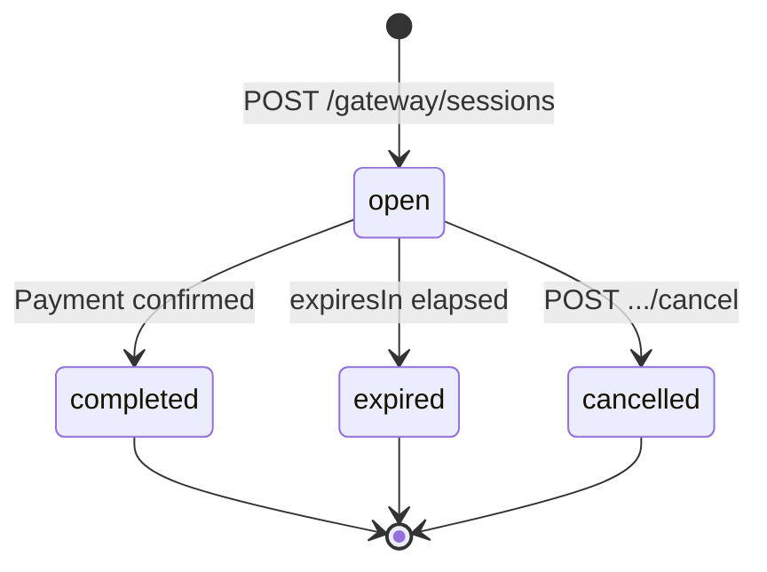

The REST path is `/gateway/sessions` (the underlying resource is called a "session"); the TypeScript SDK and the CLI both call it a **checkout** (`agentaos.checkouts`, `agenta pay checkout`).

<Warning>
The create and list responses do **not** include a plain `amount`, only `amount_override` (`null` unless you passed one). For a link-based checkout, the effective price is the link's amount. To get a single, ready-to-display price, call [Retrieve a checkout](/api-reference/checkouts/retrieve), which computes `amount` for you.
</Warning>
