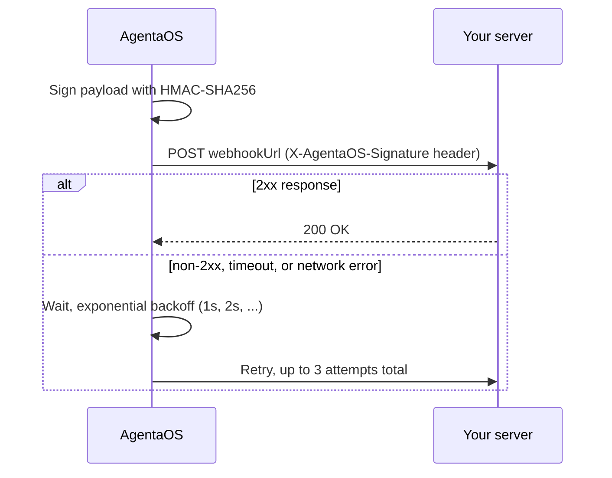

AgentaOS pushes events to a URL you configure, rather than making you poll. Configure `webhookUrl` when you [create a checkout](/api-reference/checkouts/create) or a [payment link](/api-reference/payment-links/create), or set one org-wide in the dashboard (**Settings → Developers → Webhooks**). A checkout's own `webhookUrl` wins if set, then its payment link's, then your org default, whichever is found first is the only one that fires, they don't all fire.

<Warning>
If none of the three is set, nothing is sent. That's not an error, it's silent by design, so double check you've configured a URL somewhere in the chain before relying on webhooks.
</Warning>

## Events

<AccordionGroup>
  <Accordion title="checkout.session.completed">
    Fired when a checkout's payment is confirmed, on any rail (card, wallet, stablecoin). Resolved via the checkout's own webhook, then its payment link's, then your org default.
  </Accordion>
  <Accordion title="send.completed">
    Fired when an outbound on-chain send you initiated is confirmed. Only your org-level webhook URL is checked for this event (there's no per-checkout scope for outbound sends).
  </Accordion>
  <Accordion title="send.failed">
    Fired when an outbound send's broadcast fails. Same org-level-only resolution as `send.completed`.
  </Accordion>
  <Accordion title="subscription.*">
    `created`, `renewed`, `payment_failed`, `updated`, `canceled`. Subscription lifecycle events, org-level webhook only.
  </Accordion>
</AccordionGroup>

### `checkout.session.completed`

```json
{
  "id": "evt_8c7d6e5f-4a3b-2c1d-0e9f-8a7b6c5d4e3f",
  "type": "checkout.session.completed",
  "data": {
    "link_id": "mZrESFyR7RC9RPsJfZCVkg",
    "session_id": "kR9pQwErTyUiOpAsDfGh",
    "amount": "49.99",
    "currency": "EUR",
    "rail": "card",
    "tx_hash": null,
    "vendor_reference": "pi_3P...",
    "payer": null,
    "payer_type": "human",
    "network": "stripe",
    "livemode": true,
    "overpaid_by_cents": null,
    "metadata": { "orderId": "order-123" }
  }
}
```

<ResponseField name="data.link_id" type="string | null">The payment link's `secure_link_id`, `null` for a standalone checkout.</ResponseField>
<ResponseField name="data.session_id" type="string">The checkout's public `session_id`.</ResponseField>
<ResponseField name="data.amount" type="string">Currency units, as a **string** (`"49.99"`), not a number. See [Money model](/api-reference/introduction#money-model).</ResponseField>
<ResponseField name="data.currency" type="string" />
<ResponseField name="data.rail" type="string">`card`, `sepa`, `bank_transfer`, `bridge`, or `wallet`. How the buyer actually paid.</ResponseField>
<ResponseField name="data.tx_hash" type="string | null">On-chain hash. `null` for card/bank rails, use `vendor_reference` instead.</ResponseField>
<ResponseField name="data.vendor_reference" type="string | null">Off-chain audit reference (card-processor payment reference, bank reference). `null` for on-chain rails.</ResponseField>
<ResponseField name="data.payer" type="string | null">On-chain payer address. `null` for card/bank rails.</ResponseField>
<ResponseField name="data.payer_type" type="string">`human` or `agent`.</ResponseField>
<ResponseField name="data.network" type="string">CAIP-2 network ID for on-chain rails, or `stripe` for card/bank.</ResponseField>
<ResponseField name="data.livemode" type="boolean">`true` in live mode, `false` in test mode.</ResponseField>
<ResponseField name="data.overpaid_by_cents" type="number | null">Set when a bank-transfer buyer sent more than the amount due (beyond a 1-cent tolerance). `null` otherwise.</ResponseField>
<ResponseField name="data.metadata" type="object">Whatever you set on the checkout (or its link), unchanged.</ResponseField>

### `send.completed`

```json
{
  "id": "evt_9d8e7f6a-5b4c-3d2e-1f0a-9b8c7d6e5f4a",
  "type": "send.completed",
  "data": {
    "transaction_id": "9d8e7f6a-5b4c-3d2e-1f0a-9b8c7d6e5f4a",
    "tx_hash": "0xabc123...",
    "from": "0xYourOrgWallet...",
    "to": "0xRecipient...",
    "amount": "100.00",
    "token": "USDC",
    "chain_id": 8453,
    "network": "eip155:8453",
    "livemode": true,
    "description": null
  }
}
```

### `send.failed`

Identical shape to `send.completed`, with `tx_hash: null`.

```json
{
  "id": "evt_1a2b3c4d-5e6f-7a8b-9c0d-1e2f3a4b5c6d",
  "type": "send.failed",
  "data": {
    "transaction_id": "1a2b3c4d-5e6f-7a8b-9c0d-1e2f3a4b5c6d",
    "tx_hash": null,
    "from": "0xYourOrgWallet...",
    "to": "0xRecipient...",
    "amount": "100.00",
    "token": "USDC",
    "chain_id": 8453,
    "network": "eip155:8453",
    "livemode": true,
    "description": null
  }
}
```

### `subscription.*`

`subscription.created`, `subscription.renewed`, `subscription.payment_failed`, `subscription.updated`, and `subscription.canceled` share one `data` shape. Org-level webhook only.

```json
{
  "id": "evt_3f2a1b0c-9d8e-7f6a-5b4c-3d2e1f0a9b8c",
  "type": "subscription.renewed",
  "data": {
    "id": "sub_6pC2lNB6joCRQIZ1aMrTpi",
    "status": "active",
    "plan_name": "Pro Monthly",
    "currency": "EUR",
    "amount_minor": 1000,
    "current_period_end": "2026-09-19T12:00:00.000Z",
    "cancel_at_period_end": false,
    "customer_email": "customer@example.com",
    "customer_name": "Alex Rivera",
    "livemode": true
  }
}
```

<ResponseField name="data.id" type="string">The subscription ID.</ResponseField>
<ResponseField name="data.status" type="string">Stripe status: `active`, `trialing`, `past_due`, `unpaid`, `canceled`, `incomplete`.</ResponseField>
<ResponseField name="data.plan_name" type="string | null">Plan name, from the backing payment link.</ResponseField>
<ResponseField name="data.currency" type="string" />
<ResponseField name="data.amount_minor" type="number">Per-cycle price in integer minor units. `1000` = `€10.00`.</ResponseField>
<ResponseField name="data.current_period_end" type="string | null">ISO 8601, or `null` before the first cycle.</ResponseField>
<ResponseField name="data.cancel_at_period_end" type="boolean">`true` if cancellation is scheduled for period end.</ResponseField>
<ResponseField name="data.customer_email" type="string | null" />
<ResponseField name="data.customer_name" type="string | null" />
<ResponseField name="data.livemode" type="boolean">`true` in live mode, `false` in test mode.</ResponseField>

<Note>
The raw payload above is the literal snake_case JSON body AgentaOS `POST`s to your `webhookUrl`, this is what you'll parse in any language other than the SDK. `agentaos.webhooks.verify()` (Node.js) parses it and returns a camelCased, typed object instead: `linkId`, `sessionId`, `txHash`, `payerType`, `livemode`, etc. `rail`, `vendor_reference`, and `overpaid_by_cents` arrive on the wire but are not yet reflected in the SDK's TypeScript types, they're present regardless of language.
</Note>

## Delivery



- Delivered as `POST`, `Content-Type: application/json`, body is the exact JSON shown above.
- A `10` second timeout per attempt, up to `3` attempts total, exponential backoff between retries.
- Redirects are not followed (a `3xx` response counts as a failed attempt).
- URLs resolving to private or internal addresses are rejected before any delivery attempt (SSRF guard).
- Return `2xx` quickly. Do slow work (emails, fulfillment) asynchronously after responding, a slow handler risks the delivery timing out and retrying.

## Signature verification

Every delivery includes an `X-AgentaOS-Signature` header:

```
X-AgentaOS-Signature: t=1770379200,v1=5257a869e7ecebeda32affa62cdca3fa51cad7e77a0e56ff536d0ce8e108d8bd
```

| Part | Meaning |
|---|---|
| `t` | Unix timestamp (seconds) when the signature was generated. |
| `v1` | HMAC-SHA256 hex digest of `{t}.{raw request body}`, keyed with your webhook signing secret. |

Get your signing secret (`whsec_...`) from **app.agentaos.ai → Settings → Developers → Webhooks → Reveal signing secret**. It's stable across URL changes; rotate it from the same screen if it's ever exposed.

<Tabs>
  <Tab title="SDK (Node.js)">
    ```typescript
    import { AgentaOS, WebhookVerificationError } from '@agentaos/pay';
    import express from 'express';

    const agentaos = new AgentaOS(process.env.AGENTAOS_API_KEY!);

    // Use express.raw(): verification needs the exact raw body bytes.
    app.post('/webhooks', express.raw({ type: 'application/json' }), (req, res) => {
      try {
        const event = agentaos.webhooks.verify(
          req.body,
          req.headers['x-agentaos-signature'] as string,
          process.env.AGENTAOS_WEBHOOK_SECRET!,
        );

        if (event.type === 'checkout.session.completed') {
          fulfillOrder(event.data.sessionId);
        }

        res.sendStatus(200);
      } catch (err) {
        if (err instanceof WebhookVerificationError) {
          return res.status(400).send('Invalid signature');
        }
        res.status(500).send('Webhook processing failed');
      }
    });
    ```
  </Tab>
  <Tab title="Manual (any language)">
    ```python
    import hmac, hashlib, time

    def verify_webhook(raw_body: str, signature: str, secret: str) -> bool:
        parts = dict(p.split('=', 1) for p in signature.split(','))
        timestamp = int(parts['t'])

        # Reject signatures older than 5 minutes
        if abs(time.time() - timestamp) > 300:
            return False

        expected = hmac.new(
            secret.encode(),
            f"{timestamp}.{raw_body}".encode(),
            hashlib.sha256,
        ).hexdigest()

        return hmac.compare_digest(expected, parts['v1'])
    ```
  </Tab>
</Tabs>

<Warning>
Verify against the **raw** request body bytes, before any JSON parsing or re-serialization. Re-stringifying a parsed object can reorder keys or change whitespace and silently break the signature check.
</Warning>

## Best practices

<CardGroup cols={2}>
  <Card title="Don't trust the redirect" icon="arrow-right">
    A checkout's `successUrl` is best-effort, the buyer's browser might close first. Webhooks are the source of truth for "did this actually get paid."
  </Card>
  <Card title="Handle idempotently" icon="repeat">
    A retried delivery can arrive more than once. Deduplicate on `id` (the event id) or `data.session_id`/`data.transaction_id`.
  </Card>
  <Card title="Respond fast" icon="bolt">
    Return `200` immediately, then do the slow work. A handler that blocks risks a retry and a duplicate delivery.
  </Card>
  <Card title="Verify before you trust" icon="shield-check">
    Never act on the raw body without checking `X-AgentaOS-Signature` first, anyone can `POST` to a public URL.
  </Card>
</CardGroup>

## Next steps

<CardGroup cols={2}>
  <Card title="Checkouts" icon="cart-shopping" href="/api-reference/checkouts/create">
    Set `webhookUrl` when creating a checkout.
  </Card>
  <Card title="Payment Links" icon="link" href="/api-reference/payment-links/create">
    Set a default `webhookUrl` for every checkout created from a link.
  </Card>
</CardGroup>
