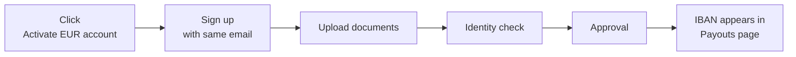

# Activate your EUR account

An IBAN in your name (or your company's name), linked to your AgentaOS wallet. Once approved, SEPA payments land directly in your AgentaOS balance.

<CardGroup cols={2}>
  <Card title="I'm an individual" icon="user" href="/banking/activate-eur-individual">
    Around 10 minutes to fill in. Approval usually within one business day.
  </Card>
  <Card title="I'm a business" icon="building" href="/banking/activate-eur-business">
    20 to 30 minutes the first time. Approval usually within 2 to 5 business days.
  </Card>
</CardGroup>

## What you get

- A real European IBAN in your name or your company's name.
- SEPA inbound transfers land in your AgentaOS balance.
- SEPA outbound (payouts) once your account is funded.
- No platform monthly fee for the bank account itself.

## How it works

The account is operated by [Monerium](https://monerium.com/), a regulated EU e-money institution licensed in Iceland under the European EMD2 framework. You sign up with your AgentaOS email so everything stays linked under one identity.
