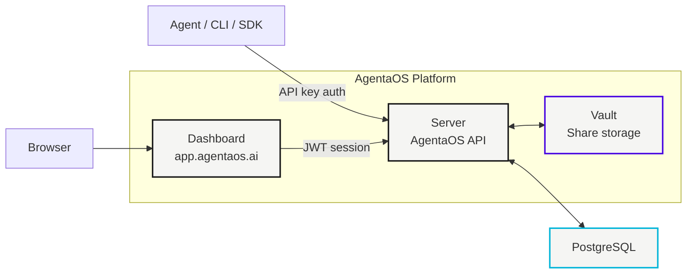
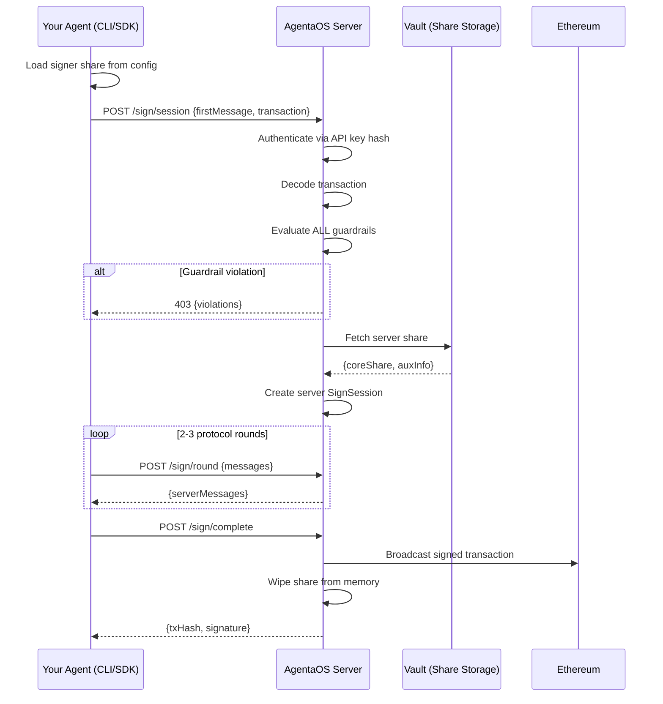

# Platform Architecture

AgentaOS is a managed platform. You use the CLI, SDK, or dashboard. We handle the infrastructure.

Here's what runs behind the scenes.



---

## Components

| Component | What It Does |
|-----------|-------------|
| **AgentaOS Server** | Runs the signing protocol, evaluates guardrails, manages signers. NestJS API. |
| **Vault** | Stores server shares encrypted at rest (HashiCorp Vault KV v2). |
| **Dashboard** | Web UI at [app.agentaos.ai](https://app.agentaos.ai). Create signers, set guardrails, sign manually. |
| **PostgreSQL** | Stores signer metadata, policies, audit logs. No key material in the database. |

---

## Signing Flow

When your agent signs a transaction, this is what happens:



Key properties:
- The **signer share never leaves your machine**. Only protocol messages cross the wire.
- The **server share is wiped from memory** after every operation (`buffer.fill(0)` in `finally` blocks).
- **Guardrails evaluate before signing starts**. If any rule blocks, the server returns 403 and never co-signs.
- The **full private key never exists**. Not during DKG. Not during signing. Not ever.

---

## Authentication

Two authentication modes:

| Mode | Who Uses It | How It Works |
|------|------------|-------------|
| **API Key** | CLI, SDK, MCP server | `x-api-key` header. Key stored as SHA-256 hash on server. |
| **JWT Session** | Dashboard (browser) | Passkey (WebAuthn) login. Server issues HTTP-only JWT cookie. |

---

## Share Storage

| Share | Where | Encryption |
|-------|-------|-----------|
| **Signer share** | Your machine (`~/.agenta/`) | AES-256-GCM with scrypt KDF |
| **Server share** | HashiCorp Vault (KV v2) | Vault transit encryption |
| **User share** | Server (opaque blob) | AES-256-GCM, key from passkey PRF via HKDF |

<Warning>
The server stores the user share blob but **cannot decrypt it**. The decryption key is derived from the user's WebAuthn passkey. The server never sees the raw user share.
</Warning>

---

## Health Check

The platform exposes a health endpoint:

```bash
curl https://api.agentaos.ai/health
```

Returns `200` when healthy, `503` when degraded. The health check verifies database connectivity and Vault reachability.

---

## Next Steps

<CardGroup cols={2}>
  <Card title="Quickstart" icon="rocket" href="/guardian/quickstart">
    Create your first signer and sign a transaction
  </Card>
  <Card title="API Reference" icon="book" href="/guardian/api-reference">
    Complete REST API documentation
  </Card>
</CardGroup>
