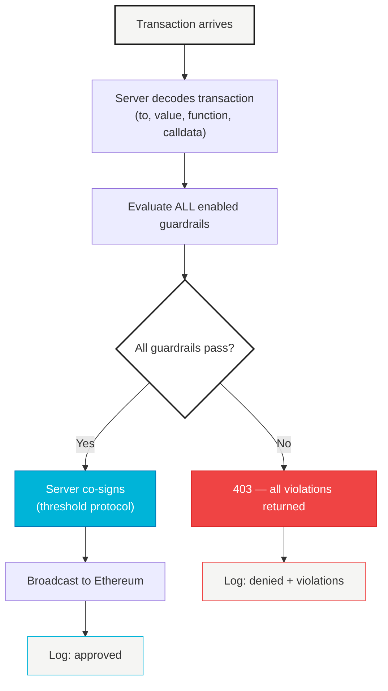

# Guardrails, Not Gatekeepers

Before any transaction gets signed, Agenta checks it against your rules. Spending too much? Blocked. Sending to an unknown address? Blocked. Too many transactions per hour? Blocked. The server refuses to co-sign until every rule passes.

Every enabled rule is checked. If any rule fails, the server returns the full list of violations — not just the first one. You see exactly what went wrong.

<Warning>
  Guardrails only apply to signing paths that involve the server (Signer+Server and User+Server). The Signer+User offline path bypasses them entirely.
</Warning>

---

## How It Works



1. Transaction arrives at the server
2. Server decodes the transaction (to, value, function selector, calldata)
3. **Every enabled guardrail is evaluated against the transaction context**
4. If ALL guardrails pass — server proceeds to co-sign
5. If ANY guardrail blocks — 403 response with all violations, logged to audit

The response includes every violation, not just the first one. You see the full picture.

```json
{
  "statusCode": 403,
  "message": "Policy violation",
  "violations": [
    {
      "policyId": "pol_abc123",
      "type": "rule_reject",
      "reason": "Transaction value 5.0 ETH exceeds per-tx limit of 1.0 ETH",
      "config": { "type": "ethValue", "operator": "<=", "value": "1000000000000000000" }
    },
    {
      "policyId": "pol_def456",
      "type": "rule_reject",
      "reason": "Address not in allowlist",
      "config": { "type": "evmAddress", "operator": "in", "addresses": ["0x..."] }
    }
  ]
}
```

---

## Rules Engine

The rules engine is Agenta's policy system. You define an ordered list of rules. Each rule has criteria and an action (`accept` or `reject`). Rules are evaluated top-to-bottom. First match wins.

<Info>
  Rules are stored as a **policy document** per signer. One document, one ordered rule set. Supports draft/active versioning.
</Info>

### Criterion Types

| Type | What It Checks | Key Fields |
|------|---------------|------------|
| `ethValue` | Cap transaction value in wei | `operator` (`<=`, `<`, `>=`, `>`, `=`), `value` |
| `evmAddress` | Allowlist or blocklist destination addresses | `operator` (`in` / `not_in`), `addresses`, `allowDeploy?` |
| `evmNetwork` | Restrict to specific chains | `operator` (`in` / `not_in`), `chainIds` |
| `evmFunction` | Allowlist function selectors (4-byte) | `selectors`, `allowPlainTransfer?` |
| `ipAddress` | Restrict by caller IP (supports CIDR) | `operator` (`in` / `not_in`), `ips` |
| `rateLimit` | Max signing requests per hour | `maxPerHour` |
| `timeWindow` | Only allow signing during specific UTC hours | `startHour`, `endHour` |
| `dailyLimit` | Rolling 24h spend cap in wei | `maxWei` |
| `monthlyLimit` | Rolling 30-day spend cap in wei | `maxWei` |
| `maxPerTxUsd` | Per-transaction USD cap (fail-closed if no price data) | `maxUsd` |
| `dailyLimitUsd` | Rolling 24h spend cap in USD | `maxUsd` |
| `monthlyLimitUsd` | Rolling 30-day spend cap in USD | `maxUsd` |
| `blockInfiniteApprovals` | Block unlimited ERC-20/ERC-721 approvals and Permit2 | `enabled` |
| `maxSlippage` | Reject swaps exceeding slippage threshold (zero slippage always blocked) | `maxPercent` |
| `mevProtection` | Block DEX swaps vulnerable to front-running | `enabled` |

<Info>
Use `evmAddress` with `operator: "in"` for allowlists (approved contracts) and `operator: "not_in"` for blocklists (blocked addresses). Known malicious addresses (burn address, dead address) are always blocked server-side regardless of your policy.
</Info>

### Rule Structure

Each rule has:
- **`action`** — `accept` or `reject`
- **`criteria`** — array of conditions (all must match for the rule to fire)
- **`description`** — human-readable label (optional)
- **`enabled`** — toggle without deleting (optional)

### Full Example

A production policy for a trading bot:

```json
{
  "rules": [
    {
      "description": "Block blacklisted addresses",
      "action": "reject",
      "criteria": [
        {
          "type": "evmAddress",
          "operator": "in",
          "addresses": [
            "0x000000000000000000000000000000000000dEaD"
          ]
        }
      ]
    },
    {
      "description": "Allow Uniswap V3 Router swaps under 1 ETH",
      "action": "accept",
      "criteria": [
        {
          "type": "evmAddress",
          "operator": "in",
          "addresses": ["0xE592427A0AEce92De3Edee1F18E0157C05861564"]
        },
        {
          "type": "ethValue",
          "operator": "<=",
          "value": "1000000000000000000"
        }
      ]
    },
    {
      "description": "Allow ERC-20 transfers under $500",
      "action": "accept",
      "criteria": [
        {
          "type": "evmFunction",
          "selectors": ["0xa9059cbb"]
        },
        {
          "type": "maxPerTxUsd",
          "maxUsd": 500
        }
      ]
    },
    {
      "description": "Rate limit to 20 tx/hour",
      "action": "reject",
      "criteria": [
        { "type": "rateLimit", "maxPerHour": 20 }
      ]
    },
    {
      "description": "Block everything else",
      "action": "reject",
      "criteria": []
    }
  ]
}
```

<Tip>
  The last rule with empty criteria acts as a default deny. If no previous rule matched, this catches everything. Always end your rule set with a catch-all.
</Tip>

---

## Built-in Policies

For quick setup, Agenta supports individual policies per signer. These are standalone constraints — no ordered evaluation, just hard pass/fail checks on every transaction.

| Type | Config | What It Enforces |
|------|--------|-----------------|
| `spending_limit` | `{ maxWei: "..." }` | Max value per transaction |
| `daily_limit` | `{ maxWei: "..." }` | Rolling 24h spend cap |
| `monthly_limit` | `{ maxWei: "..." }` | Rolling 30-day spend cap |
| `allowed_contracts` | `{ addresses: [...] }` | Whitelist of contract addresses |
| `allowed_functions` | `{ selectors: [...] }` | Whitelist of function selectors |
| `blocked_addresses` | `{ addresses: [...] }` | Blacklist of destination addresses |
| `rate_limit` | `{ maxPerHour: N }` | Max signing requests per hour |
| `time_window` | `{ startHour, endHour }` | UTC hours when signing is allowed |

Built-in policies are evaluated alongside rules engine policies. Every active constraint must pass before the server co-signs.

---

## API Endpoints

<Tabs>
  <Tab title="Rules Engine">
    ```
    GET    /api/v1/signers/:id/policy           # Get active policy
    PUT    /api/v1/signers/:id/policy           # Save + activate rules
    GET    /api/v1/signers/:id/policy/draft     # Get draft policy
    PUT    /api/v1/signers/:id/policy/draft     # Save as draft
    POST   /api/v1/signers/:id/policy/activate  # Activate draft
    POST   /api/v1/signers/:id/policy/backtest  # Backtest against history
    ```
  </Tab>
  <Tab title="Built-in Policies">
    ```
    GET    /api/v1/signers/:id/policies    # List policies for signer
    POST   /api/v1/signers/:id/policies    # Create policy
    PATCH  /api/v1/policies/:id            # Update policy
    DELETE /api/v1/policies/:id            # Delete policy
    ```
  </Tab>
</Tabs>

---

## Audit Trail

Every signing request is logged. Approved or denied. The audit log records:

- Which guardrails were evaluated
- Which violations occurred
- Evaluation time in milliseconds
- The decoded transaction (to, value, function, calldata)
- Final status (approved, denied, broadcast, failed)

Nothing is silent. Every decision is recorded.
