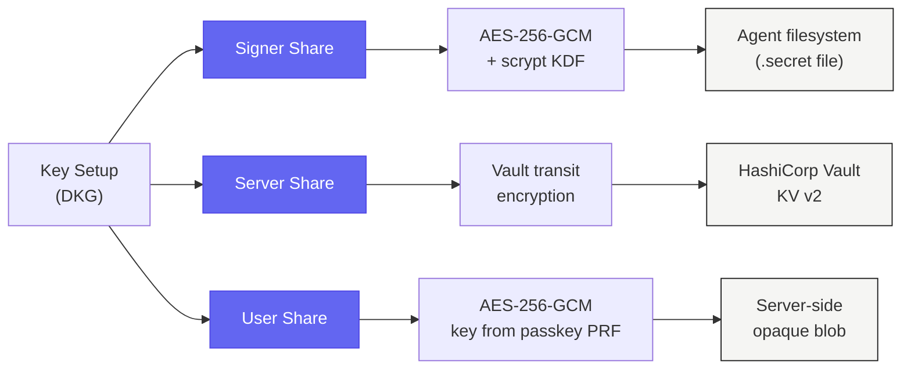
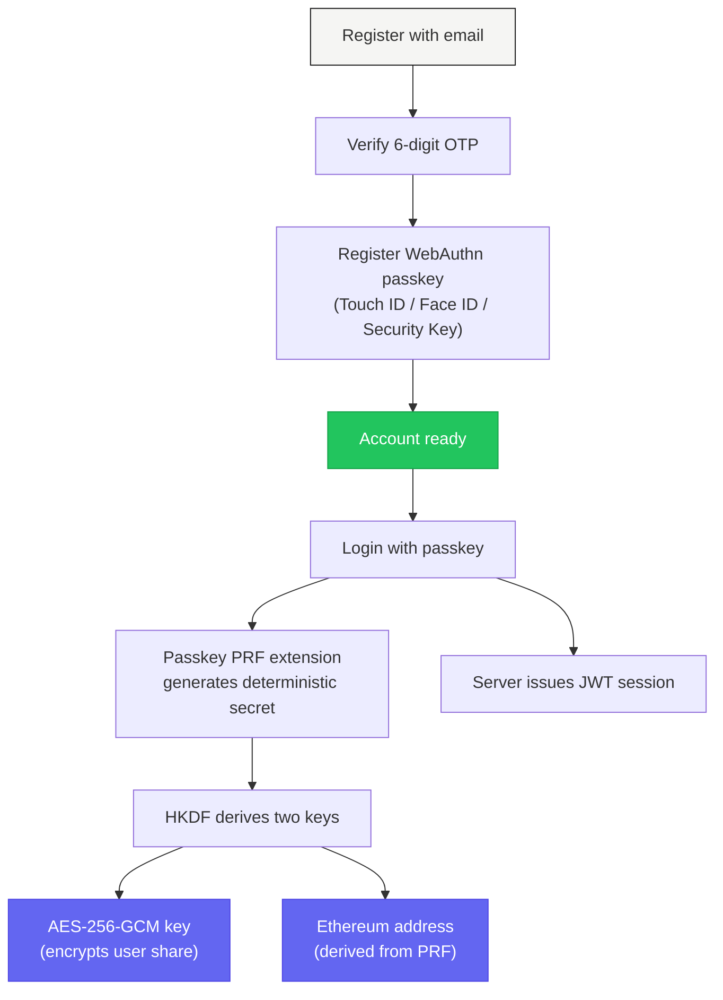

# Security Model

Guardian Wallet is built around one idea: the full private key must never exist. Everything else follows from that.

---

## Share Storage

Each share is stored differently. Each has its own encryption and access controls.



| Share | Where | Encryption | Access |
|-------|-------|-----------|--------|
| **Server share** | HashiCorp Vault KV v2 (prod) or local-file AES-256-GCM (dev) | Vault's transit encryption or AES-256-GCM envelope | Server process only, wiped after each operation |
| **User share** | Server-side opaque blob | AES-256-GCM, key derived from passkey PRF via HKDF | Only the user's passkey can decrypt |
| **Signer share** | Agent filesystem | AES-256-GCM with scrypt KDF | Only the agent with the passphrase |

<Warning>
  The server stores the user share blob but **cannot decrypt it**. The decryption key is derived from the user's WebAuthn passkey PRF output. The server never sees the raw user share.
</Warning>

---

## Guarantees

### No key reconstruction

Zero code paths combine shares into a full private key. Not during DKG. Not during signing. Not during recovery. The full key never exists.

### Share wiping

Server shares are erased from memory with `buffer.fill(0)` in `finally` blocks after every signing operation. No share data persists in server memory between requests.

### No key material in logs

Share bytes never appear in logs, error messages, or stack traces. Grep the entire codebase for share data —zero matches.

### API key hashing

API keys are stored as SHA-256 hashes. The plaintext key exists only on the agent's machine in its config file. The server only stores and compares hashes. Timing-safe comparison prevents side-channel attacks.

### Browser isolation

User+Server signing runs CGGMP24 entirely in browser WASM. The server sees only protocol messages. It never sees the decrypted user share, the PRF output, or the derived encryption key.

### Interactive protocol

Signing requires live, multi-round message exchange between two parties. There are no pre-computed partial signatures to steal. An attacker who compromises one share still cannot sign anything alone.

---

## Authentication

Guardian uses a two-step authentication flow.



### Email + OTP

Users register with an email address. A 6-digit OTP is sent for verification. OTP hashes are stored with timing-safe comparison. Codes expire after use.

### WebAuthn Passkeys

After email verification, users register a WebAuthn passkey. All subsequent logins use passkey authentication. No passwords. No seed phrases.

### PRF Key Derivation

The passkey's PRF (Pseudo-Random Function) extension generates a deterministic secret from each authentication. This secret is run through HKDF to derive:

1. An AES-256-GCM encryption key for the user share
2. An Ethereum address derived from the PRF output

The PRF output never leaves the browser. The server never sees it.

<Info>
  PRF is a WebAuthn extension supported by platform authenticators (Touch ID, Windows Hello, Android biometrics). It produces a deterministic secret tied to the passkey credential.
</Info>

### JWT Sessions

After passkey authentication, the server issues a JWT session token. Dashboard API calls use this token via HTTP-only cookies. Tokens expire. Sessions are invalidated on logout.

---

## KMS Providers

Guardian abstracts secret storage behind the `IKmsProvider` interface. Two implementations ship:

<Tabs>
  <Tab title="Vault KV v2 (Production)">
    HashiCorp Vault with the KV v2 secrets engine. Server shares are stored at `secret/signers/{id}/server-share`. Vault handles encryption at rest, access control, and audit logging.

    ```
    VAULT_ADDR=https://vault.yourinfra.com:8200
    VAULT_TOKEN=hvs.xxxxx
    ```
  </Tab>
  <Tab title="Local File (Development)">
    AES-256-GCM envelope encryption with a local master key. Suitable for development and testing. Not recommended for production.

    ```
    KMS_PROVIDER=local-file
    KMS_LOCAL_MASTER_KEY=<64-char-hex>
    ```
  </Tab>
</Tabs>

Both providers implement the same interface:

- `generateDataKey()` —creates a new data encryption key
- `decryptDataKey()` —decrypts a stored data key
- `healthCheck()` —verifies provider availability
- `destroy()` —wipes any in-memory key material

---

## Threat Model

| Threat | Mitigation |
|--------|-----------|
| Server compromised | Attacker gets one share. Cannot sign alone. Needs a second share. |
| Agent compromised | Attacker gets one share + passphrase. Cannot sign without server. Revoke the signer. |
| User passkey stolen | Attacker needs the physical authenticator. PRF is hardware-bound. |
| Database breach | No shares in the database. API keys are hashed. User share blob is encrypted. |
| Network eavesdropping | HTTPS only. Protocol messages reveal nothing about shares. |
| Server memory dump | Shares are wiped in finally blocks. Window of exposure is milliseconds. |
| Guardrail bypass | Guardrails run server-side before co-signing. Agent cannot skip them on the Signer+Server path. |

<Note>
  The Signer+User offline path bypasses the server and its guardrails. This is by design —it is the disaster recovery path. If you need to enforce guardrails on all paths, do not distribute user shares to signers.
</Note>

---

## Responsible Disclosure

Found a vulnerability? Email **security@agentokratia.com**. We take every report seriously.

Do not open public issues for security vulnerabilities. Use the email above. We will respond within 48 hours.
