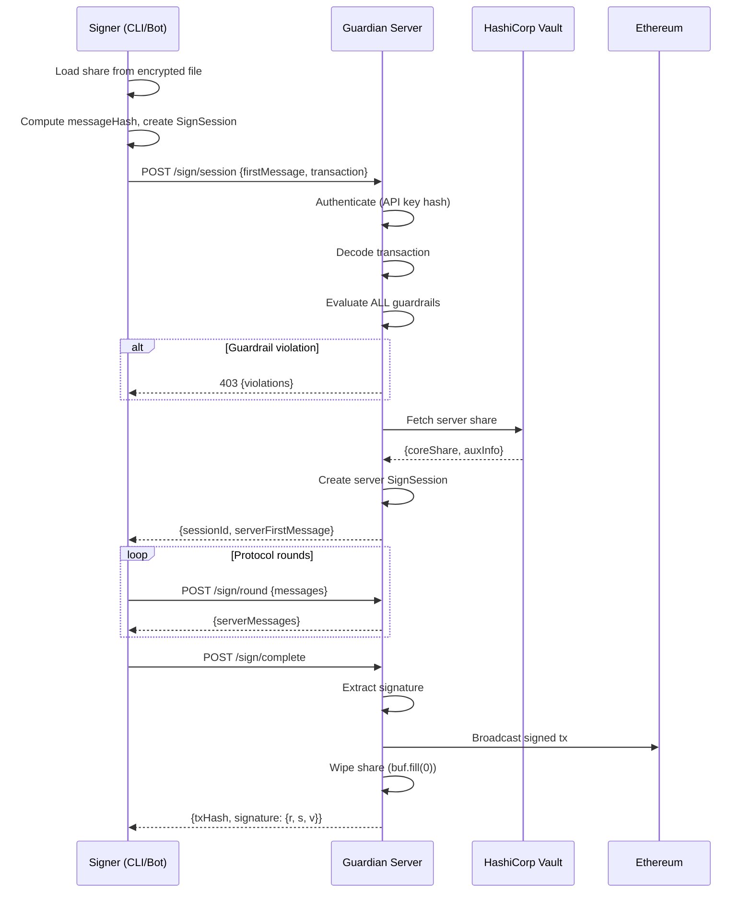
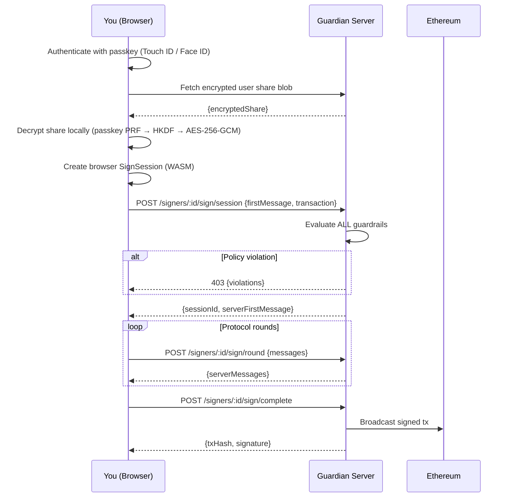

# Three Paths, One Signature

Guardian Wallet has three signing paths. Each uses a different pair of shares. Each fits a different situation.

| Path | Shares Used | Auth | Best For |
|------|-------------|------|----------|
| **Signer + Server** | Agent share + Server share | API key | Bots, scripts, scheduled tasks |
| **User + Server** | Passkey-encrypted share + Server share | JWT session | Manual transactions, emergency overrides |
| **Signer + User** | Agent share + User share | None (offline) | Server down, compliance bypass |

All three paths produce identical ECDSA signatures. The Ethereum network cannot tell which path signed a transaction. The result is the same.

---

## Signer + Server

The primary path. Your agent signs autonomously.

The signer (bot, script, CLI) holds its share locally. The server holds its share in Vault. They run the CGGMP24 protocol together over HTTPS. The server evaluates guardrails before participating.

**How it works:**

1. Signer loads its share from the local encrypted file
2. Signer computes the message hash and starts a local signing session
3. Signer sends `POST /sign/session` with its first protocol message + the transaction
4. Server authenticates via API key hash lookup
5. Server decodes the transaction and runs the guardrails
6. If any guardrail blocks, the server returns 403 with violations. Signing never starts.
7. Server fetches its share from Vault, starts its signing session
8. Multi-round message exchange via `POST /sign/round`
9. Protocol completes —signature produced
10. Server broadcasts the signed transaction
11. Server wipes its share from memory
12. Return `{ txHash, signature: { r, s, v } }`



<Info>
  The signer never sends its share to the server. Only protocol messages cross the wire. The server never learns the signer's share.
</Info>

---

## User + Server

The dashboard override path. You sign manually from the browser.

Your user share is stored on the server, encrypted. The server cannot decrypt it — only your passkey (Touch ID, Windows Hello, or a hardware key) can unlock it. When you sign from the dashboard, the browser decrypts your share locally and runs the signing protocol against the server. The server only sees protocol messages, never your raw share.



<Note>
  The server only sees protocol messages during User+Server signing. It never sees the raw user share. All decryption happens in the browser via WebAssembly.
</Note>

**Best for:**

- Manual transaction review and approval
- Emergency overrides when the agent is offline
- High-value transactions that need human confirmation

---

## Signer + User

The offline recovery path. No server needed.

If the server is down or unreachable, the signer and user can co-sign directly. The signer holds its share locally. The user provides their share (decrypted via passkey or backup). They run the protocol peer-to-peer.

**Best for:**

- Server outage recovery
- Compliance scenarios requiring server bypass
- Disaster recovery

<Warning>
  Signer+User signing bypasses guardrails entirely. The server is not involved, so no rules are evaluated. Use this path only when necessary.
</Warning>

---

## When to Use Each Path

- **Automated operations** (trading bots, payment processors, scheduled transfers) —use Signer+Server. Guardrails protect you.
- **Manual oversight** (large transfers, contract deployments, sensitive operations) —use User+Server from the dashboard. You approve each transaction.
- **Server down** —use Signer+User. Get the transaction through, then fix the server.

<CardGroup cols={3}>
  <Card title="Signer + Server" icon="robot">
    **Autonomous.** Bot signs. Server co-signs. Guardrails enforced.
  </Card>
  <Card title="User + Server" icon="user">
    **Manual.** You sign in the browser. Server co-signs. Guardrails enforced.
  </Card>
  <Card title="Signer + User" icon="shield-halved">
    **Offline.** No server. No guardrails. Emergency only.
  </Card>
</CardGroup>

---

## API Endpoints

<Tabs>
  <Tab title="Signer + Server">
    ```
    POST /api/v1/sign/session       # Start signing session
    POST /api/v1/sign/round         # Exchange protocol messages
    POST /api/v1/sign/complete      # Finalize + broadcast
    ```
    Auth: `x-api-key` header
  </Tab>
  <Tab title="User + Server">
    ```
    POST /api/v1/signers/:id/sign/session    # Start signing session
    POST /api/v1/signers/:id/sign/round      # Exchange protocol messages
    POST /api/v1/signers/:id/sign/complete   # Finalize + broadcast
    ```
    Auth: JWT session cookie
  </Tab>
  <Tab title="Message Signing">
    ```
    POST /api/v1/sign-message/session    # Start message signing
    POST /api/v1/sign-message/complete   # Finalize -> {v, r, s}
    ```
    Auth: `x-api-key` header
  </Tab>
</Tabs>
