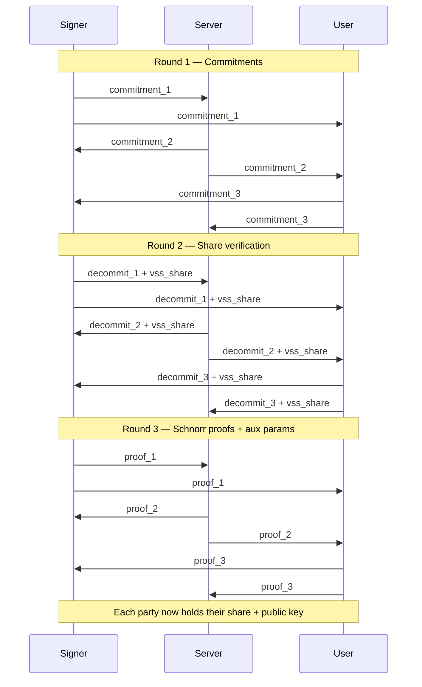
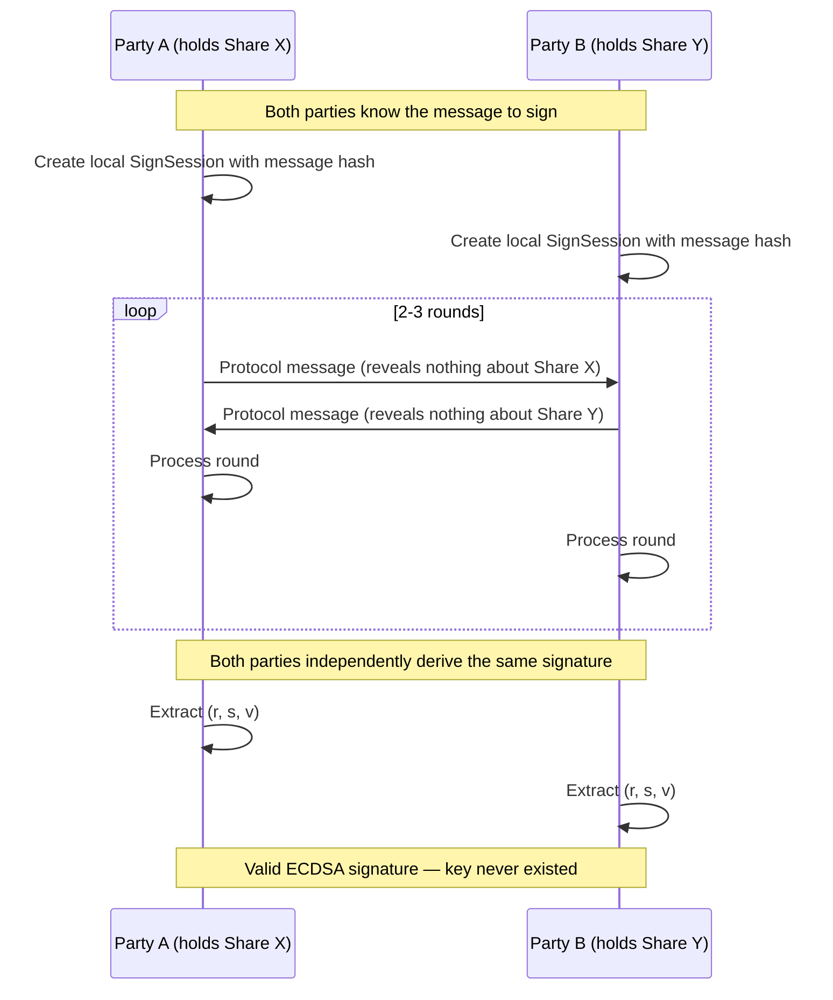

# The Key That Never Exists

Guardian Wallet has one core invariant:

<Warning>
  **The full private key must never exist.**
  Not in memory. Not in logs. Not in any variable. Not in any code path.
  Every signing operation is a distributed computation between two share holders.
</Warning>

Traditional wallets store a private key somewhere. A file. An HSM. A browser extension. One place, one target.

Guardian splits it. Three shares. No single share is useful alone. No share is ever combined with another to reconstruct the original key. The original key never existed in the first place.

---

## How the cryptography works

Guardian uses the **CGGMP24** threshold signing protocol — the current state of the art for splitting ECDSA keys. The name comes from its creators (Canetti, Gennaro, Goldfeder, Makriyannis, Peled) and the year of their latest paper. You don't need to know this to use Guardian. But if you want to audit the math, the paper is linked in the Research section below.

The protocol has two phases:

1. **Distributed Key Generation (DKG)** —three parties jointly create a public key and their own shares. No trusted dealer. No single party ever sees the full key.
2. **Threshold Signing** —any 2 of 3 parties run an interactive protocol to produce a valid ECDSA signature. Multi-round message exchange. Not a pre-computed partial signature.

<Info>
  The implementation uses the `cggmp24` Rust crate (v0.7.0) compiled to WebAssembly. Same code runs server-side (Node.js) and client-side (browser).
</Info>

---

## Distributed Key Generation

DKG is how shares are born. Three parties —Signer, Server, User —each run the protocol independently. After 3 rounds of message exchange, each party holds:

- A **core share** (their piece of the key)
- **Auxiliary info** (public parameters for signing)
- The **public key** (shared, derived from all three shares without combining them)

No party learns anything about the other parties' shares. The public key is derived from cryptographic commitments, not from raw share data.



<Tip>
  DKG completes in under 5 seconds. Run it once per signer. The shares persist. You only repeat DKG if you need to rotate keys.
</Tip>

---

## 2-of-3 Threshold

Three shares. Any two can sign. No single share can act alone.

| Share | Holder | Storage |
|-------|--------|---------|
| Share 0 | **Signer** (agent/bot) | Agent filesystem, AES-256-GCM encrypted |
| Share 1 | **Server** | HashiCorp Vault KV v2 |
| Share 2 | **User** (wallet owner) | Server-side opaque blob, encrypted with passkey PRF |

This gives you three signing paths:

<CardGroup cols={3}>
  <Card title="Signer + Server" icon="robot">
    Normal autonomous operation. Bot signs with server co-signing.
  </Card>
  <Card title="User + Server" icon="user">
    Dashboard override. You sign manually via browser WASM.
  </Card>
  <Card title="Signer + User" icon="shield-halved">
    Offline recovery. No server needed.
  </Card>
</CardGroup>

---

## Interactive Protocol

Signing is not a one-shot operation. It is a multi-round interactive protocol.



Each round, both parties exchange cryptographic messages. Neither party can compute the signature alone. Neither party learns the other's share from the messages.

The protocol guarantees:

- **No key reconstruction** — shares stay separate throughout
- **Proven security** — formally verified under the strongest known security model for multi-party protocols
- **Non-interactive proactive refresh** — shares can be refreshed without a new DKG (future)

---

## Implementation

The signing engine is a Rust crate compiled to WASM.

```
packages/mpc-wasm/    # Rust WASM bindings for CGGMP24
```

Both the server and the browser load the same WASM module. The server runs it in Node.js. The dashboard runs it in the browser. Same protocol, same code, different environments.

<Note>
  Server shares are wiped from memory (`buffer.fill(0)`) in `finally` blocks after every signing operation. No share data persists in server memory between requests.
</Note>

---

## Research

The protocol is based on:

> Canetti, Gennaro, Goldfeder, Makriyannis, Peled. **UC Non-Interactive, Proactive, Threshold ECDSA with Identifiable Aborts.** Cryptology ePrint Archive, Report 2021/060.

The CGGMP24 variant adds efficiency improvements and a simplified round structure compared to earlier threshold ECDSA schemes (GG18, GG20, CGGMP21).
