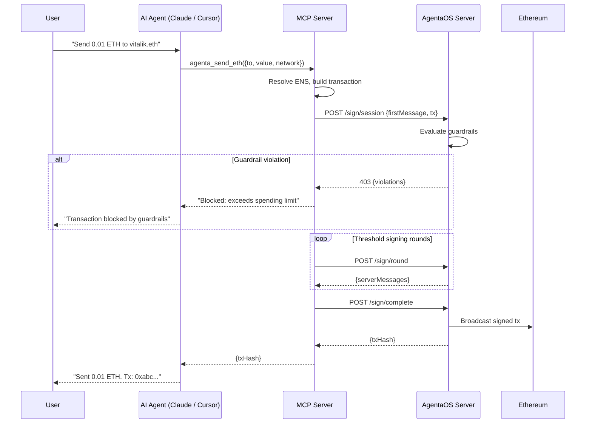

# MCP Server

Model Context Protocol (MCP) lets AI assistants call tools. AgentaOS's MCP server exposes account operations as tools. Your agent says "send 0.01 ETH" and the signing protocol runs behind the scenes.

No raw keys. No manual RPC calls. Just intent.

## Setup

Add Agenta to your MCP client config. Works with Claude Desktop, Cursor, or any MCP-compatible client.

```json
{
  "mcpServers": {
    "agentaos": {
      "command": "npx",
      "args": ["agentaos"],
      "env": {
        "AGENTA_API_KEY": "gw_live_your-api-key",
        "AGENTA_API_SECRET": "base64-encoded-key-material",
        "AGENTA_NETWORK": "base-sepolia"
      }
    }
  }
}
```

| Variable | Required | Default | Description |
|----------|----------|---------|-------------|
| `AGENTA_API_KEY` | Yes | — | API key (`gw_live_*` or `gw_test_*`) |
| `AGENTA_API_SECRET` | Yes | — | Base64-encoded signer share (from `agenta init` or the dashboard) |
| `AGENTA_SERVER` | No | `https://api.agentaos.ai` | AgentaOS server URL |
| `AGENTA_NETWORK` | No | — | Default network for tools (e.g. `base-sepolia`, `mainnet`, `arbitrum`) |

<Info>
  The MCP server loads the signer share from `AGENTA_API_SECRET` at startup. On shutdown (SIGINT/SIGTERM), it wipes the share from memory.
</Info>

---

## Tool Reference

18 tools organized by category. All tool names use the `agenta_` prefix. Every `network` parameter accepts a network name string (e.g. `'base-sepolia'`, `'mainnet'`, `'arbitrum'`). Call `agenta_list_networks` first to discover available networks.

### Discovery

#### `agenta_wallet_overview`

Get a complete overview of the wallet — address, balances, tracked token balances, and recent transactions.

```typescript
// Input
{
  network?: string  // Network name (e.g. 'base-sepolia'). Required to show balances.
}
```

#### `agenta_list_networks`

List all available networks configured on the server. Returns network name, CAIP-2 networkId, chain ID, testnet status, and native currency.

```typescript
// Input: no parameters
```

#### `agenta_list_signers`

List all signers accessible with the current API key. Shows name, ID, address, chain, network, and status.

```typescript
// Input: no parameters
```

#### `agenta_resolve_address`

Resolve an ENS name (e.g. `vitalik.eth`) to an Ethereum address.

```typescript
// Input
{
  addressOrEns: string  // Required. ENS name or 0x address to resolve.
}
```

---

### Transfers

#### `agenta_send_eth`

Send ETH to any address or ENS name. Uses threshold signing — the full private key never exists. Policy-enforced by the server.

```typescript
// Input
{
  to: string       // Required. Recipient — 0x address or ENS name (e.g. 'vitalik.eth')
  value: string    // Required. Amount in ETH (e.g. '0.01', '1.5')
  network?: string // Network name (e.g. 'base-sepolia')
}
```

#### `agenta_send_token`

Send ERC-20 tokens by symbol (e.g. `USDC`, `WETH`) or contract address. Automatically handles decimal conversion.

```typescript
// Input
{
  token: string    // Required. Token symbol ('USDC', 'WETH') or contract address (0x...).
  to: string       // Required. Recipient — 0x address or ENS name.
  amount: string   // Required. Amount in human-readable units (e.g. '100' for 100 USDC).
  network?: string // Network name (e.g. 'base-sepolia')
}
```

#### `agenta_get_balances`

Get ETH balance and optionally ERC-20 token balances.

```typescript
// Input
{
  tokens?: string[]  // Optional. Array of ERC-20 token addresses (0x...) to check.
  network?: string   // Network name (e.g. 'base-sepolia')
}
```

---

### Contract Interaction

#### `agenta_call_contract`

Call a function on any smart contract using threshold signing. Provide the contract ABI, function name, and arguments.

```typescript
// Input
{
  contractAddress: string    // Required. Contract address (0x..., 40 hex chars).
  abi: object[]              // Required. Contract ABI (JSON array of function/event definitions).
  functionName: string       // Required. Function name (e.g. 'swap', 'approve', 'mint').
  args?: unknown[]           // Optional. Function arguments as ordered array. Default: [].
  value?: string             // Optional. ETH to send with call, in ETH (e.g. '0.1'). Default: '0'.
  network?: string           // Network name (e.g. 'base-sepolia')
}
```

#### `agenta_read_contract`

Read data from a smart contract (view/pure functions). No gas spent, no signing needed.

```typescript
// Input
{
  contractAddress: string    // Required. Contract address (0x...).
  abi: object[]              // Required. Contract ABI (can be just the relevant function fragment).
  functionName: string       // Required. View/pure function name (e.g. 'balanceOf', 'totalSupply').
  args?: unknown[]           // Optional. Function arguments. Default: [].
  network?: string           // Network name (e.g. 'base-sepolia')
}
```

#### `agenta_execute`

Execute a raw Ethereum transaction with pre-encoded calldata. For advanced use cases where you already have encoded transaction data.

```typescript
// Input
{
  to: string       // Required. Target address (0x..., 40 hex chars).
  data: string     // Required. Pre-encoded calldata as hex (0x...).
  value?: string   // Optional. ETH to send, in ETH (e.g. '0.1'). Default: '0'.
  network?: string // Network name (e.g. 'base-sepolia')
}
```

#### `agenta_simulate`

Simulate a transaction to estimate gas cost before sending. No signing, no broadcast. Use before `agenta_send_eth` or `agenta_call_contract` to verify success and see gas estimates.

```typescript
// Input
{
  to: string       // Required. Target address (0x..., 40 hex chars).
  value?: string   // Optional. ETH value in ETH units (e.g. '0.1'). Default: '0'.
  data?: string    // Optional. Calldata as hex (0x...). Omit for simple ETH transfers.
  network?: string // Network name (e.g. 'base-sepolia')
}
```

---

### Signing

#### `agenta_sign_message`

Sign an arbitrary message using threshold signing (EIP-191 personal signature). No gas spent.

```typescript
// Input
{
  message: string  // Required. The message to sign (plain text, min 1 char).
}
```

#### `agenta_sign_typed_data`

Sign EIP-712 typed data. Used for x402 payments, Permit2 approvals, ERC-3009 transfers, and off-chain structured signatures. No gas spent.

```typescript
// Input
{
  domain: object       // Required. EIP-712 domain (e.g. { name: 'USD Coin', version: '2', chainId: 84532, verifyingContract: '0x...' })
  types: object        // Required. EIP-712 type definitions (e.g. { Message: [{ name: 'content', type: 'string' }] })
  primaryType: string  // Required. Primary type name (e.g. 'ReceiveWithAuthorization', 'PermitTransferFrom')
  message: object      // Required. The structured message data to sign.
}
```

---

### x402 Payment Protocol

#### `agenta_x402_check`

Check if a URL requires x402 payment. Returns payment requirements (scheme, network, amount, asset) for each accepted payment option.

```typescript
// Input
{
  url: string  // Required. URL to check for x402 payment requirements (must be valid URL).
}
```

#### `agenta_x402_discover`

Discover x402-protected endpoints on a domain. Probes common paths and the `.well-known/x402` endpoint to find paid resources.

```typescript
// Input
{
  domain: string  // Required. Domain to probe (e.g. 'api.example.com' or 'https://api.example.com').
}
```

#### `agenta_x402_fetch`

Fetch a 402-protected resource, automatically paying via the x402 exact scheme (ERC-3009/Permit2). Network and asset are auto-detected from the 402 response.

```typescript
// Input
{
  url: string        // Required. URL to fetch (must be valid URL).
  maxAmount?: string // Optional. Max amount to pay in atomic units (e.g. '1000000' = 1 USDC). If omitted, any amount is accepted.
}
```

---

### Management

#### `agenta_get_status`

Get server health status and signer information. Use to verify the server is running and the signer is configured.

```typescript
// Input: no parameters
```

#### `agenta_get_audit_log`

Get recent signing activity from the audit log. Shows past transactions, policy evaluations, decoded function calls, and gas costs.

```typescript
// Input
{
  limit?: number   // Number of entries (default: 20, max: 100).
  status?: string  // Filter: 'all' | 'completed' | 'blocked' | 'failed' (default: 'all').
  page?: number    // Page number for pagination (default: 1).
}
```

---

## How It Works



1. Agent receives a user request ("Send 0.01 ETH to vitalik.eth")
2. Agent calls `agenta_send_eth` with `{ to: "vitalik.eth", value: "0.01", network: "base-sepolia" }`
3. MCP server resolves ENS, builds the transaction
4. Threshold signing runs — signer share + server share co-sign via CGGMP24
5. Server evaluates guardrails before co-signing
6. Transaction broadcasts. Agent gets back the tx hash.

The full private key never exists at any point.

---

## Example Conversations

### Check balance and send ETH

```text
User: What's my balance on Base Sepolia?

Agent: [calls agenta_wallet_overview with network: "base-sepolia"]
       Your wallet (0x1a2b...3c4d) has 0.42 ETH on Base Sepolia.

User: Send 0.01 ETH to vitalik.eth

Agent: [calls agenta_send_eth with to: "vitalik.eth", value: "0.01", network: "base-sepolia"]
       Sent 0.01 ETH to vitalik.eth (0xd8dA...6045).
       Tx: 0xabc...def
```

### Read a contract and call a function

```text
User: What's the total supply of USDC on Base?

Agent: [calls agenta_list_networks to find "mainnet" or "base"]
       [calls agenta_read_contract with contractAddress: "0x833589fCD6eDb6E08f4c7C32D4f71b54bdA02913",
        abi: [{"type":"function","name":"totalSupply","inputs":[],"outputs":[{"type":"uint256"}],"stateMutability":"view"}],
        functionName: "totalSupply", network: "mainnet"]
       USDC total supply on Base: 3,240,000,000 USDC
```

### Pay for an x402-protected API

```text
User: Can you check if api.example.com has paid endpoints?

Agent: [calls agenta_x402_discover with domain: "api.example.com"]
       Found 2 x402-protected endpoints:
       - GET /api/premium — $0.01 USDC (exact scheme, Base)
       - GET /api/data — $0.05 USDC (exact scheme, Base)

User: Fetch the premium endpoint

Agent: [calls agenta_x402_fetch with url: "https://api.example.com/api/premium"]
       Paid $0.01 USDC. Response: { "data": "premium content..." }
```

---

## Security Model

<Tip>
  Every tool call that modifies state (send, sign, deploy) runs through the full threshold signing protocol. The server evaluates all active guardrails before co-signing. If a guardrail blocks the transaction, the tool returns the violation details.
</Tip>

Your agent holds one share locally (loaded from `AGENTA_API_SECRET`). The AgentaOS server holds another. Neither can sign alone. Both must cooperate on every transaction — but no single party ever sees the full key.

Read operations (`agenta_get_balances`, `agenta_read_contract`, `agenta_get_status`) do not involve key material.
