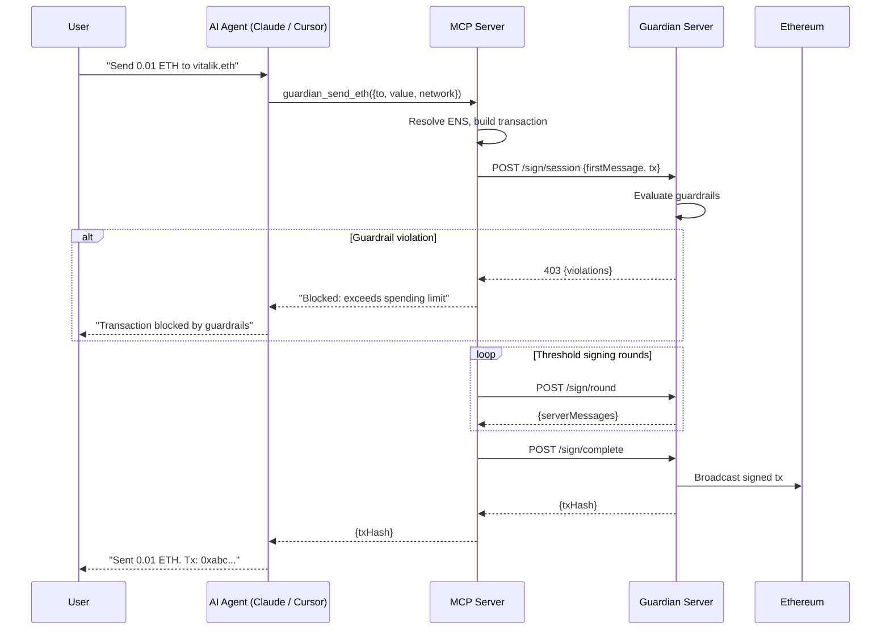

# MCP Server

Model Context Protocol (MCP) lets AI assistants call tools. Guardian's MCP server exposes wallet operations as tools. Your agent says "send 0.01 ETH" and the signing protocol runs behind the scenes.

No raw keys. No manual RPC calls. Just intent.

## Setup

Add Guardian to your MCP client config. Works with Claude Desktop, Cursor, or any MCP-compatible client.

```json
{
  "mcpServers": {
    "guardian-wallet": {
      "command": "npx",
      "args": ["@agentokratia/guardian-wallet"],
      "env": {
        "GUARDIAN_SERVER": "http://localhost:8080",
        "GUARDIAN_API_KEY": "gw_live_...",
        "GUARDIAN_API_SECRET": "base64-encoded-key-material",
        "GUARDIAN_NETWORK": "base-sepolia"
      }
    }
  }
}
```

| Variable | Required | Description |
|----------|----------|-------------|
| `GUARDIAN_SERVER` | No | Guardian server URL (default: `http://localhost:8080`) |
| `GUARDIAN_API_KEY` | Yes | API key for the signer (`gw_live_...` or `gw_test_...`) |
| `GUARDIAN_API_SECRET` | Yes | Base64-encoded signer share (from `gw init` or the dashboard) |
| `GUARDIAN_API_SECRET_FILE` | No | Alternative: path to a file containing the secret |
| `GUARDIAN_NETWORK` | No | Default network for tools (e.g. `base-sepolia`) |

<Info>
  The MCP server loads the signer share from `GUARDIAN_API_SECRET` (or reads it from `GUARDIAN_API_SECRET_FILE`) at startup. On shutdown (SIGINT/SIGTERM), it wipes the share from memory. Both `GUARDIAN_API_KEY` and `GUARDIAN_API_SECRET` are required.
</Info>

---

## Available Tools

### Discovery

| Tool | Description |
|------|-------------|
| `guardian_wallet_overview` | Full wallet summary —address, balances, recent activity |
| `guardian_list_networks` | List all configured networks |
| `guardian_list_signers` | List all signers |
| `guardian_resolve_address` | Resolve ENS name to address |

### Transfers

| Tool | Description |
|------|-------------|
| `guardian_send_eth` | Send ETH to an address or ENS name |
| `guardian_send_token` | Send ERC-20 tokens by symbol or address |
| `guardian_get_balances` | Check ETH and token balances |

### Contract Interaction

| Tool | Description |
|------|-------------|
| `guardian_call_contract` | Call any contract function with ABI |
| `guardian_read_contract` | Read contract state (no gas) |
| `guardian_execute` | Execute raw transaction data |
| `guardian_simulate` | Simulate a transaction before sending |

### Signing

| Tool | Description |
|------|-------------|
| `guardian_sign_message` | Sign an arbitrary message (EIP-191) |
| `guardian_sign_typed_data` | Sign EIP-712 typed data |

### x402 Payment Protocol

| Tool | Description |
|------|-------------|
| `guardian_x402_check` | Check if a URL requires x402 payment |
| `guardian_x402_discover` | Discover x402-protected endpoints on a domain |
| `guardian_x402_fetch` | Fetch a 402-protected resource with auto-payment |

### Management

| Tool | Description |
|------|-------------|
| `guardian_get_status` | Server health and signer info |
| `guardian_get_audit_log` | View signing history |

---

## How It Works



1. Agent receives a user request ("Send 0.01 ETH to vitalik.eth")
2. Agent calls `guardian_send_eth` with `{ to: "vitalik.eth", value: "0.01", network: "base-sepolia" }`
3. MCP server resolves ENS, builds the transaction
4. Threshold signing runs — signer share + server share co-sign via CGGMP24
5. Server evaluates guardrails before co-signing
6. Transaction broadcasts. Agent gets back the tx hash.

The full private key never exists at any point.

---

## Example Conversation

```text
User: What's my balance?

Agent: [calls guardian_wallet_overview]
       Your wallet (0x1a2b...3c4d) has 0.42 ETH on Base Sepolia.

User: Send 0.01 ETH to vitalik.eth

Agent: [calls guardian_send_eth]
       Sent 0.01 ETH to vitalik.eth (0xd8dA...6045).
       Tx: 0xabc...def
```

---

## Security Model

<Tip>
  Every tool call that modifies state (send, sign, deploy) runs through the full threshold signing protocol. The server evaluates all active guardrails before co-signing. If a guardrail blocks the transaction, the tool returns the violation details.
</Tip>

The MCP server holds one share. The Guardian server holds another. Neither can sign alone. Both must agree on every transaction.

Read operations (`guardian_get_balances`, `guardian_read_contract`, `guardian_get_status`) do not involve key material.
