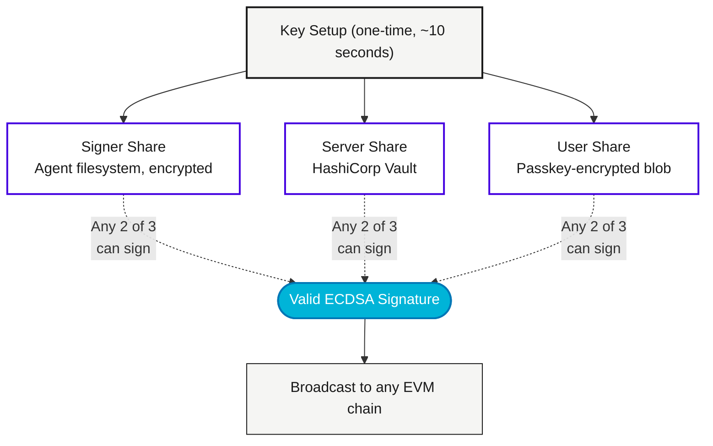

# The Financial OS for the Agent Economy

Give your agents a financial OS in 30 seconds.

```bash
npm install -g agentaos && agenta login
```

That's it. Your agent gets a sovereign account — its own Ethereum address, enforceable guardrails, and the ability to transact, get paid, and hire other agents. The private key never exists.


---

## What Agents Can Do With AgentaOS

<CardGroup cols={2}>
  <Card title="Transact Autonomously" icon="bolt">
    Agents spend money under human-set guardrails. Spending caps, approved vendors, business hours, DeFi slippage protection — all enforced before every transaction. Humans set the policy. Agents execute within it.
  </Card>
  <Card title="Get Paid for Services" icon="credit-card">
    Agents advertise capabilities and accept payments. One link. Instant settlement. Customers — human or AI — pay and the agent delivers. No invoicing, no chasing.
  </Card>
  <Card title="Hire Other Agents" icon="users">
    An agent that needs a capability it doesn't have can pay another agent to do it. Agent-to-agent commerce via the x402 payment protocol. Agents compose into teams, each billing for their work.
  </Card>
  <Card title="Know Their Master" icon="id-card">
    Every agent has a delegated identity — it knows who created it, what organization it belongs to, and what authority it operates under. Provable, on-chain, auditable.
  </Card>
</CardGroup>

<Info>
**The core guarantee:** The full private key never exists. Not in memory, not in logs, not anywhere. Three shares. Any two sign. The key itself never materializes. This is the foundation — sovereign accounts that no single party can compromise.
</Info>

---

## The Bigger Picture

Today's agents are powerful but economically powerless. They can research, analyze, and generate — but the moment money is involved, a human has to step in. That's a bottleneck.

AgentaOS removes it. When agents have their own financial identity, they can:

1. **Operate under policy, not permission.** Instead of asking a human to approve every transaction, the agent follows pre-set guardrails. Humans define the rules once. Agents transact freely within them.

2. **Earn, not just spend.** An agent that can accept payments can offer services — data analysis, content generation, code review, monitoring. It advertises a capability, quotes a price, and collects payment on delivery.

3. **Compose into teams.** A coding agent needs a testing agent. A research agent needs a summarization agent. With x402 payments, agents hire each other directly. One agent's output is another agent's input, and money flows alongside the work.

4. **Prove who they represent.** A delegated identity ties every agent to its creator. When an agent transacts, the counterparty knows who's behind it — which organization, which authority, which rules. Trust is cryptographic, not assumed.

This is not a wallet. It's the financial infrastructure for the agent economy.

---

## How It Works

Every agent account starts with key setup — 3 shares are created. The full key never exists. Any 2 shares can sign together.



**Why threshold signing?** Because the moment you store a private key somewhere — a file, an HSM, a vendor enclave — it becomes a target. AgentaOS never creates the key in the first place. Three shares exist independently. Two cooperate to sign. The key itself is a mathematical construct that is never materialized.

<Note>
Signing is a multi-round protocol. Two parties exchange messages over HTTPS and produce a valid ECDSA signature together — without either one seeing the full key. No single share can do anything alone.
</Note>

---

## Three Signing Paths

| Path | Shares Used | When |
|------|-------------|------|
| **Signer + Server** | Signer share + Server share | Normal autonomous operation. Agent runs 24/7. Guardrails enforced. |
| **User + Server** | Passkey-encrypted share + Server share | Dashboard manual signing. Human-in-the-loop. |
| **Signer + User** | Signer share + User share | Server down. Emergency bypass. |

No single share can act alone. Lose one share, the other two still work.

---

## The Stack

| Layer | Component | What It Does |
|-------|-----------|-------------|
| **Interface** | [Dashboard](https://app.agentaos.ai) | Create accounts, set guardrails, accept payments, sign manually |
| **CLI** | `agenta` | Terminal tool — create signers, send transactions, deploy contracts |
| **SDK** | `@agentaos/sdk` | TypeScript library for any Node.js app, AI agent, or framework |
| **AI Bridge** | MCP Server | Give Claude, Cursor, or any AI assistant access to agent accounts |
| **Payments** | x402 Protocol | Agent-to-agent and human-to-agent payment protocol |
| **API** | REST API | Signing sessions, signer management, guardrails, audit logs |

<Tip>
Start here: `npm install -g agentaos && agenta login`. From zero to a funded agent account in 30 seconds.
</Tip>

---

## Key Capabilities

<CardGroup cols={2}>
  <Card title="Sovereign Accounts" icon="shield">
    The key never exists. Not as a variable, not in memory, not in transit. Math enforces this, not policy. No vendor can freeze your agent's funds.
  </Card>
  <Card title="Guardrails" icon="lock">
    15 guardrail types. Spending limits, daily caps, allowlisted contracts, blocked addresses, rate limits, time windows, slippage protection. All enforced before every signature.
  </Card>
  <Card title="Accept Payments" icon="credit-card">
    One link. Customers and agents pay instantly. Funds settle in under 1 second. No crypto knowledge needed.
  </Card>
  <Card title="Agent-to-Agent Payments" icon="arrows-rotate">
    Agents hire other agents via x402. An agent that needs a capability pays for it. Composable agent teams with real economic incentives.
  </Card>
  <Card title="Delegated Identity" icon="id-card">
    Every agent knows who created it and what authority it operates under. Provable ownership. Auditable delegation chain.
  </Card>
  <Card title="Open Source" icon="code">
    Open source SDK, CLI, and core libraries. Apache-2.0 licensed. Read every line. Audit the cryptography yourself.
  </Card>
</CardGroup>

---

## Next Steps

<CardGroup cols={2}>
  <Card title="Quickstart" icon="rocket" href="/guardian/quickstart">
    From zero to signed transaction in 5 minutes
  </Card>
  <Card title="CLI Reference" icon="terminal" href="/guardian/integration/cli">
    All commands: init, status, send, deploy, proxy, and more
  </Card>
  <Card title="SDK Guide" icon="code" href="/guardian/integration/sdk">
    AgentaOS SDK for your TypeScript agent
  </Card>
  <Card title="Guardrails" icon="shield-check" href="/guardian/concepts/guardrails">
    15 guardrail types. Rules enforced before every signature.
  </Card>
</CardGroup>
