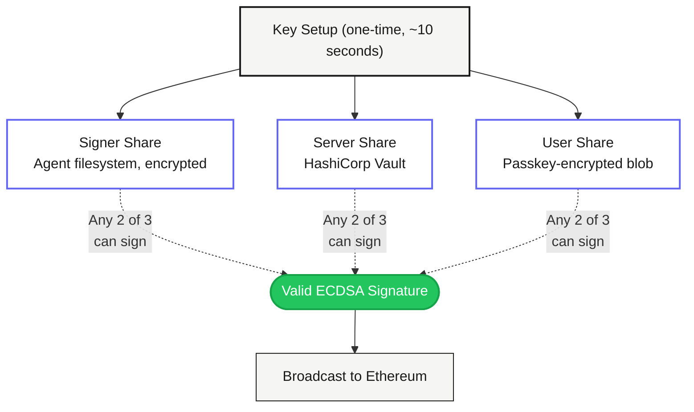

# Guardian Wallet

Give your AI agents their own crypto wallets — without ever exposing a private key.

The private key is never assembled. Not during creation. Not during signing. Not ever. Three shares. Any two sign. The key itself? It doesn't exist.

<Info>
**The key rule:** The private key is never assembled. Not in memory, not in logs, not anywhere. Two shares cooperate to sign — neither one ever sees the full key.
</Info>

---

## Who is Guardian for?

- **AI agent builders** who need bots to send transactions autonomously
- **Dev teams** who want on-chain signing without trusting a .env file
- **Anyone tired of paying Fireblocks $50k/yr** for key management they could self-host

If your agent can spend money, Guardian makes sure a single hack can't drain everything.

---

## The Problem

Every wallet today forces a tradeoff: convenience or security. Pick one.

| Approach | Convenience | Security | What Goes Wrong |
|----------|-------------|----------|----------------|
| Hot wallet (raw key in .env) | High | None | Key leaks. You lose everything. |
| Smart contract wallet | Medium | Medium | Complex social recovery. One wrong signer and funds lock. |
| Hardware security module (HSM) | Low | High | Expensive hardware. Vendor lock-in. Not agent-friendly. |
| Standard MPC (2-of-2) | Medium | High | Both parties must be online. No backup. |
| **Guardian (2-of-3 threshold)** | **High** | **High** | **No single share can sign. Lose one, the other two still work.** |

Guardian eliminates the tradeoff.

### What it replaces

| Before | After |
|--------|-------|
| Fireblocks ($50k-$500k/yr) | Self-hosted. Free. Open source. |
| Privy embedded wallets (vendor custody) | You hold the shares. No vendor. |
| Raw private key in .env | Key doesn't exist. Can't be stolen. |
| Multisig (Gnosis Safe) | No on-chain overhead. Same address, any EVM chain. |

---

## How It Works

**Key setup** creates 3 shares. The full key never exists. Any 2 shares can sign together.

<Note>
Signing is a multi-round protocol. Two parties exchange messages over HTTPS and produce a valid signature together — without either one seeing the full key. No single share can do anything alone.
</Note>

---

## Three Signing Paths

| Path | Shares Used | When |
|------|-------------|------|
| **Signer + Server** | Signer share + Server share | Normal autonomous operation. Agent runs 24/7. |
| **User + Server** | Passkey-encrypted share + Server share | Dashboard manual signing. No browser extensions needed. |
| **Signer + User** | Signer share + User share | Server down. Emergency bypass. |

No single share can do anything alone. Lose one share, the other two still work.

---

## Key Features

<CardGroup cols={2}>
  <Card title="Zero-Knowledge Signing" icon="shield">
    The key literally does not exist. Not as a variable, not in memory, not in transit. Math enforces this, not policy.
  </Card>
  <Card title="Guardrails" icon="lock">
    Spending limits. Daily caps. Allowlisted contracts. Blocked addresses. Rate limits. Time windows. Rules enforced before every signature.
  </Card>
  <Card title="Self-Hosted" icon="server">
    Your infra. Your keys. Docker Compose up and you're running. No third-party custody. No vendor lock-in.
  </Card>
  <Card title="AI Agent Ready" icon="robot">
    TypeScript SDK. CLI tool. MCP server. Your agent gets its own Ethereum address, its own key shares, its own guardrails.
  </Card>
  <Card title="Browser Signing" icon="browser">
    Sign transactions directly from the dashboard. Your share is decrypted in the browser — the server never sees it. No browser extensions needed.
  </Card>
  <Card title="Open Source" icon="code">
    AGPL-3.0 server. Apache-2.0 SDK, CLI, and core libraries. Read every line. Audit everything.
  </Card>
</CardGroup>

---

## What's in the box

| Component | What It Does |
|-----------|-------------|
| **Server** | Runs the signing protocol, enforces guardrails, stores server shares in Vault |
| **Dashboard** | Web UI for creating signers, setting guardrails, and manual signing |
| **CLI** (`gw`) | Terminal tool — create signers, send transactions, deploy contracts |
| **SDK** | TypeScript library — drop Guardian into any Node.js app, AI agent, or framework |
| **MCP Server** | Give Claude, Cursor, or any AI assistant access to your wallet |

<Tip>
Start with the CLI. `gw init` creates a signer, generates the shares, and gives you a working Ethereum address in under 30 seconds.
</Tip>

---

## Next Steps

<CardGroup cols={2}>
  <Card title="Quickstart" icon="rocket" href="/guardian/quickstart">
    From zero to signing in 5 minutes
  </Card>
  <Card title="CLI Reference" icon="terminal" href="/guardian/integration/cli">
    All commands: init, status, info, balance, send, sign-message, deploy, proxy, admin.
  </Card>
  <Card title="SDK Guide" icon="code" href="/guardian/integration/sdk">
    ThresholdSigner for your TypeScript agent
  </Card>
  <Card title="Self-Hosting" icon="server" href="/guardian/self-hosting">
    Docker Compose. Your machine. Your rules.
  </Card>
</CardGroup>
