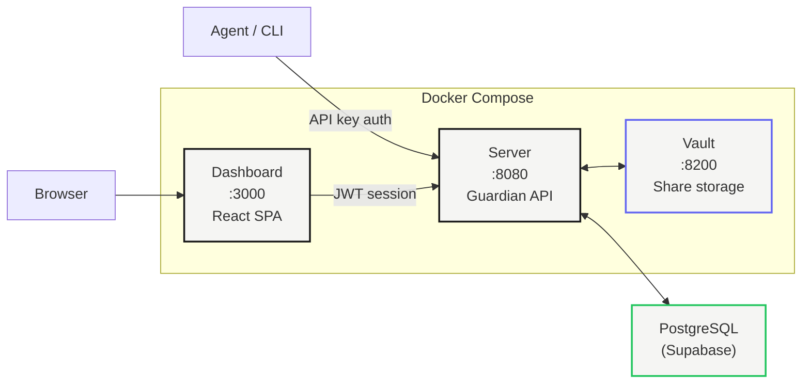

# Self-Hosting

Your infra. Your keys. No third-party custody.

Guardian Wallet runs as three containers. One command to deploy.



---

## Docker Compose

The fastest path to production.

```bash
git clone https://github.com/agentokratia/guardian-wallet.git
cd guardian-wallet
cp .env.production.example .env
```

Edit `.env`. Replace every `CHANGE-ME` placeholder. Then:

```bash
docker compose up -d
```

Three services come up:

| Service | Port | Purpose |
|---------|------|---------|
| `vault` | 8200 | Share storage (HashiCorp Vault, KV v2) |
| `server` | 8080 | Guardian API (NestJS) |
| `app` | 3000 | Dashboard (React SPA) |

Verify everything is healthy:

```bash
curl http://localhost:8080/api/v1/health
```

<Tip>
First run pulls images and initializes Vault. Takes a couple minutes. Subsequent starts are fast.
</Tip>

---

## Environment Variables —Server

All server configuration lives in `.env`. The server reads these at startup.

| Variable | Required | Default | Description |
|----------|----------|---------|-------------|
| `SUPABASE_URL` | Yes | —| PostgreSQL connection URL (Supabase or direct Postgres) |
| `SUPABASE_SERVICE_KEY` | Yes | —| Supabase service role key (full DB access) |
| `JWT_SECRET` | Yes | —| Secret for signing session JWTs. Use 64+ random chars. |
| `KMS_PROVIDER` | Yes | `vault-kv` | Key management backend: `vault-kv` or `local-file` |
| `KMS_LOCAL_KEY_FILE` | No | —| Path to local key file (only when `KMS_PROVIDER=local-file`) |
| `VAULT_ADDR` | Yes* | `http://127.0.0.1:8200` | Vault server address (*required when using `vault-kv`) |
| `VAULT_TOKEN` | Yes* | —| Vault access token (*required when using `vault-kv`) |
| `VAULT_KV_MOUNT` | No | `secret` | Vault KV v2 mount path |
| `VAULT_SHARE_PREFIX` | No | `guardian/shares` | Vault path prefix for server shares |
| `PORT` | No | `8080` | Server listen port |
| `JWT_EXPIRY` | No | `24h` | Session token expiry (e.g. `1h`, `7d`) |
| `ALLOWED_ORIGINS` | No | `http://localhost:3000` | CORS allowed origins (comma-separated) |
| `RP_ID` | No | `localhost` | WebAuthn Relying Party ID (your domain) |
| `RP_NAME` | No | `Guardian Wallet` | WebAuthn Relying Party display name |
| `EMAIL_PROVIDER` | No | —| Email provider for notifications (`resend`) |
| `RESEND_API_KEY` | No | —| API key for Resend email service |

<Info>
When `KMS_PROVIDER=vault-kv`, `VAULT_ADDR` and `VAULT_TOKEN` are required. When `KMS_PROVIDER=local-file`, only `KMS_LOCAL_KEY_FILE` is needed. Local file mode is for development only.
</Info>

---

## Environment Variables —Dashboard

The dashboard is a static React SPA. One variable.

| Variable | Required | Default | Description |
|----------|----------|---------|-------------|
| `VITE_API_URL` | Yes | `http://localhost:8080` | Guardian server URL. Set to your production server address. |

Set this at build time. Vite bakes it into the bundle.

```bash
VITE_API_URL=https://api.yourdomain.com pnpm --filter @agentokratia/guardian-app build
```

---

## Production Notes

<Warning>
**Do not run production with dev defaults.** Every item below matters.

- **Vault:** Switch to production mode with auto-unseal. Enable TLS. Dev mode stores everything in memory —a restart wipes all shares.
- **TLS:** Terminate at a reverse proxy (nginx, Caddy, or cloud load balancer). Never expose HTTP directly.
- **Database:** Use managed Supabase or a dedicated PostgreSQL instance with connection pooling (PgBouncer).
- **Secrets:** Generate strong random values for `JWT_SECRET` and `VAULT_TOKEN`. Never reuse dev tokens. Use `openssl rand -hex 32` at minimum.
- **Resources:** Set memory and CPU limits in your Docker Compose file. The server needs at least 512MB RAM for WASM signing operations.
</Warning>

---

## Health Check

The server exposes a health endpoint that reports component status:

```bash
curl http://localhost:8080/api/v1/health
```

Returns `200` when healthy, `503` when degraded. Use this for load balancer health checks and monitoring.

<Note>
The health endpoint checks database connectivity and Vault reachability. If Vault is sealed or unreachable, the server returns 503 and refuses signing requests.
</Note>

---

## Next Steps

<CardGroup cols={2}>
  <Card title="Quickstart" icon="rocket" href="/guardian/quickstart">
    Create your first signer and sign a transaction
  </Card>
  <Card title="API Reference" icon="book" href="/guardian/api-reference">
    Complete REST API documentation
  </Card>
</CardGroup>
