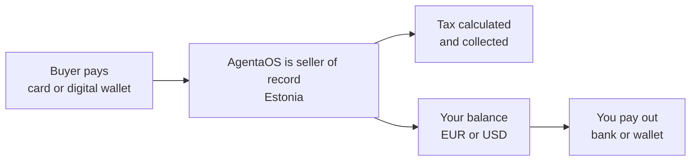

When you sell digital products across borders, you don't just owe tax at home. You typically owe VAT or sales tax in your buyer's country too, and you're responsible for registering, collecting, and filing it correctly in every one of those countries. AgentaOS removes that problem by becoming the legal seller of record on every transaction you make through us. If you're new to AgentaOS, start with the [introduction](/introduction).

## What a Merchant of Record is

A Merchant of Record (MoR) is the company that is legally responsible for a sale. It appears on the receipt, it collects the payment, and it owes the tax authority for that transaction. Most payment processors don't do this: they move money for you, but you stay the seller of record and you stay responsible for the tax.

AgentaOS is different. We stand in as the seller of record on every payment. Our Estonian entity is the legal seller your buyer transacts with, not you. That one change is what lets us calculate, collect, and remit tax on your behalf instead of leaving it to you.

## Why it matters

Cross-border tax compliance doesn't scale for a small team. Tracking rates, registering in each country, filing returns, and issuing tax-correct invoices in every buyer's jurisdiction is a job most founders don't have time for, and getting it wrong carries real financial and legal risk.

A Merchant of Record takes that job off your plate entirely. You sell. We handle the tax.

## How a payment flows

<Steps>
  <Step title="Buyer pays">
    Your customer checks out by card or digital wallet (Apple Pay, Google Pay). They see AgentaOS as the seller on the payment page and the receipt.
  </Step>
  <Step title="AgentaOS is the seller of record">
    We calculate the tax due based on what's being sold and where the buyer is, and collect it as part of the payment.
  </Step>
  <Step title="Money lands on your balance">
    Your share of the payment, after fees, settles into your AgentaOS balance in EUR or USD. Tax is already accounted for, you don't set it aside yourself.
  </Step>
  <Step title="You pay out">
    Move your balance to your bank account, in EUR or USD, or your wallet, on your schedule. See [Payouts](/payouts/overview).
  </Step>
</Steps>

## Merchant of Record vs. payment processor

| | Payment processor (used directly) | Merchant of Record (AgentaOS) |
|---|---|---|
| Legal seller on the receipt | You | AgentaOS |
| Who owes VAT / sales tax | You, in every country your buyers are in | AgentaOS registers, collects, and remits |
| Who issues the invoice | You | AgentaOS, tax itemized on every invoice |
| Compliance filings | Your responsibility | Off your plate |
| What you integrate | Payments only | Payments, tax, invoicing, and payouts, in one |

<Note>
A processor and a Merchant of Record aren't mutually exclusive. AgentaOS uses our card processor under the hood to move card and bank payments. We also carry the legal and tax weight that using a processor directly would leave with you.
</Note>

## What stays yours

- Your product, your pricing, your customer relationship.
- Your payout schedule and destination, bank or wallet.
- Your own company's income tax and bookkeeping. AgentaOS handles the tax on the sale itself, not your business's own tax return.

## Refunds and chargebacks

Disputes are part of selling online. As your Merchant of Record, AgentaOS also handles refunds and chargebacks on your behalf: when a buyer disputes a charge with their card issuer or bank, AgentaOS responds to it as the seller of record, so you are not the one fielding the dispute or wiring money back yourself.

## FAQ

<AccordionGroup>
  <Accordion title="Is AgentaOS just a payment processor?">
    No. A payment processor used directly leaves you as the seller of record, responsible for tax. AgentaOS is a Merchant of Record: we become the seller of record and handle VAT, sales tax, and invoicing for every sale.
  </Accordion>
  <Accordion title="Whose name does my buyer see?">
    Our Estonian entity appears as the seller of record on the payment page, the receipt, and the invoice. See [Invoices](/payments/invoices).
  </Accordion>
  <Accordion title="Do I still need an accountant?">
    Probably, for your own company's books and income tax. What you won't need to do is register for or file VAT and sales tax on the sales you make through AgentaOS. We handle that as the seller of record.
  </Accordion>
  <Accordion title="Where does my money go after a sale?">
    It settles into your AgentaOS balance in EUR or USD. From there you pay out to your bank account or your wallet. See [Payouts](/payouts/overview).
  </Accordion>
  <Accordion title="Which countries does this cover?">
    See [Supported countries](/mor/supported-countries) for where you can sell and get paid, and [Tax](/mor/tax) for where we're registered to collect and remit.
  </Accordion>
</AccordionGroup>

## Next steps

<CardGroup cols={3}>
  <Card title="Getting started" icon="rocket" href="/introduction">
    The AgentaOS overview, if you're just getting started.
  </Card>
  <Card title="Supported countries" icon="earth-europe" href="/mor/supported-countries">
    Where you can sell and where you can get paid.
  </Card>
  <Card title="How tax works" icon="scale-balanced" href="/mor/tax">
    Destination VAT, where we're registered, and what shows up on the invoice.
  </Card>
  <Card title="Pricing" icon="credit-card" href="/mor/pricing">
    How the per-transaction fee works.
  </Card>
  <Card title="Invoices" icon="file-invoice" href="/payments/invoices">
    What a tax-correct invoice looks like, and how to export one.
  </Card>
  <Card title="Payouts" icon="money-bill-transfer" href="/payouts/overview">
    Move your balance to your bank or wallet.
  </Card>
</CardGroup>
