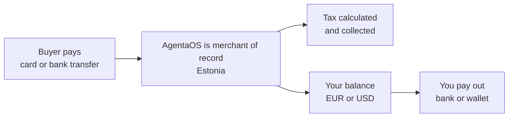

When you sell digital products across borders, you don't just owe tax at home. You also owe VAT or sales tax in your buyer's country, and you're responsible for registering, collecting, and filing it correctly in every one of those countries. AgentaOS removes that problem by becoming the merchant of record, the legal seller, on every sale you make through AgentaOS. If you're new to AgentaOS, start with the [introduction](/introduction).

## The merchant of record role

A merchant of record (MoR) is the company that is legally responsible for a sale. It appears on the receipt, it collects the payment, and it owes the tax authority for that transaction. Most payment processors don't do this: they move money for you, but you stay the merchant of record and you stay responsible for the tax.

AgentaOS is the merchant of record on every payment. The legal seller your buyer pays is AgentaOS's Estonian entity, not you. Because AgentaOS is the seller, AgentaOS calculates, collects, and pays the tax on your behalf.

## A growth merchant of record

The agentaos.ai home page says: "A Merchant of Record sells your product in its own name: it takes the payment, files the tax and handles disputes. A growth Merchant of Record also helps you earn more. AgentaOS includes an AI pricing agent that finds why users don't pay and tells you what to charge." With your account, the pricing agent reads your pricing page and writes up what to change first. See [Revenue & Pricing Audit](/grow/pricing-audit).

## The cost of doing it yourself

Cross-border tax compliance doesn't scale for a small team. Tracking rates, registering in each country, filing returns, and issuing tax-correct invoices in every buyer's jurisdiction is a job most founders don't have time for, and getting it wrong carries real financial and legal risk.

A merchant of record takes that job from you: you sell, and AgentaOS handles the tax.

## How a payment flows

```mermaid
flowchart LR
    A[Buyer pays<br/>card or bank transfer] --> B[AgentaOS is merchant of record<br/>Estonia]
    B --> C[Tax calculated<br/>and collected]
    B --> D[Your balance<br/>EUR or USD]
    D --> E[You pay out<br/>bank or wallet]
```

<Steps>
  <Step title="Buyer pays">
    Your customer checks out by card, with Apple Pay and Google Pay on devices that support them, or by bank transfer on EUR sales. They see AgentaOS as the seller on the payment page and the receipt.
  </Step>
  <Step title="AgentaOS is the merchant of record">
    AgentaOS calculates the tax due based on what's being sold and where the buyer is, and collects it as part of the payment.
  </Step>
  <Step title="Money lands on your balance">
    What you earn from the payment, after fees, settles into your AgentaOS balance in EUR or USD. Tax is already accounted for: you do not set it aside yourself.
  </Step>
  <Step title="You pay out">
    Move your balance to your bank account, in EUR or USD, or your wallet, on your schedule. See [Payouts](/payouts/overview).
  </Step>
</Steps>

## Merchant of record compared with a payment processor

| | Payment processor (used directly) | Merchant of record (AgentaOS) |
|---|---|---|
| Legal seller on the receipt | You | AgentaOS |
| Who owes VAT | You, in every country your buyers are in | AgentaOS collects and remits it |
| Who issues the invoice | You | AgentaOS, tax itemized on every invoice |
| Compliance filings | Your responsibility | Off your plate |
| What you integrate | Payments only | Payments, tax, invoicing, and payouts, in one |

<Note>
A payment processor and a merchant of record are different things, and one can use the other. AgentaOS uses a card processor to move the money. AgentaOS is the legal seller in front of it, so AgentaOS carries the tax liability that you would carry if you used the processor directly. A lost dispute costs you the sale plus the dispute fee: see [Refunds and disputes](/mor/refunds-and-disputes).
</Note>

## Your responsibilities

- Your product, your pricing, your customer relationship.
- Your payout schedule and destination, bank or wallet.
- Your own company's income tax and bookkeeping. AgentaOS handles the tax on the sale itself, not your business's own tax return.

## Refunds and chargebacks

Disputes are part of selling online. As your merchant of record, AgentaOS also handles refunds and chargebacks on your behalf: when a buyer disputes a charge with their card issuer or bank, AgentaOS responds to it as the merchant of record, so you are not the one fielding the dispute or wiring money back yourself.

## FAQ

<AccordionGroup>
  <Accordion title="Is AgentaOS just a payment processor?">
    No. A payment processor used directly leaves you as the merchant of record, responsible for tax. AgentaOS is a merchant of record: AgentaOS is the legal seller and handles VAT and invoicing for every sale.
  </Accordion>
  <Accordion title="Whose name does my buyer see?">
    AgentaOS's Estonian entity appears as the seller on the payment page, the receipt, and the invoice. See [Invoices](/payments/invoices).
  </Accordion>
  <Accordion title="Do I still need an accountant?">
    Yes, for your own company's books and income tax. What you won't need to do is register for or file VAT on the sales you make through AgentaOS. AgentaOS handles that as the merchant of record.
  </Accordion>
  <Accordion title="Where does my money go after a sale?">
    It settles into your AgentaOS balance in EUR or USD. From there you pay out to your bank account or your wallet. See [Payouts](/payouts/overview).
  </Accordion>
  <Accordion title="Which countries does this cover?">
    See [Supported countries](/mor/supported-countries) for where you can sell and get paid, and [Tax](/mor/tax) for where AgentaOS is registered to collect and pay tax.
  </Accordion>
</AccordionGroup>

## Next steps

<Columns cols={3}>
  <Card title="Getting started" icon="rocket" href="/introduction">
    The AgentaOS overview, if you're just getting started.
  </Card>
  <Card title="Supported countries" icon="earth-europe" href="/mor/supported-countries">
    Where you can sell and where you can get paid.
  </Card>
  <Card title="How tax works" icon="scale-balanced" href="/mor/tax">
    Where AgentaOS is registered for VAT, and what shows up on the invoice.
  </Card>
  <Card title="Pricing" icon="credit-card" href="/mor/pricing">
    How the per-transaction fee works.
  </Card>
  <Card title="Invoices" icon="file-invoice" href="/payments/invoices">
    What a tax-correct invoice looks like, and how to export one.
  </Card>
  <Card title="Payouts" icon="money-bill-transfer" href="/payouts/overview">
    Move your balance to your bank or wallet.
  </Card>
</Columns>
