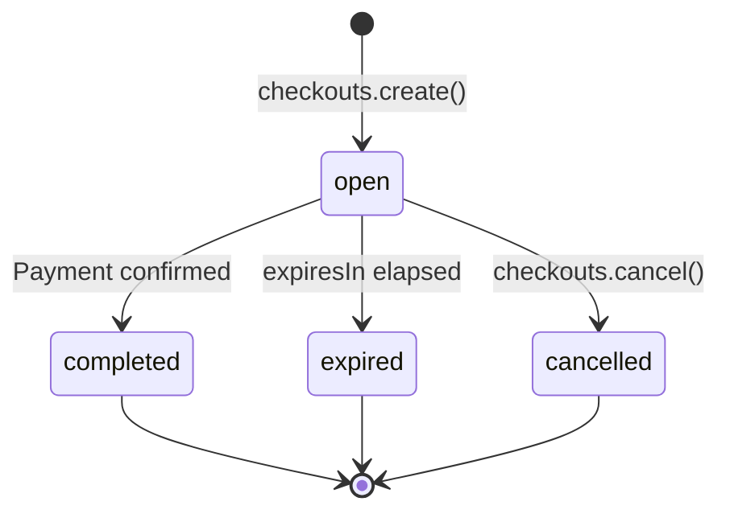

A checkout represents a single payment attempt. Create one to collect a payment from a customer.



## Create a Checkout

```typescript
const checkout = await agentaos.checkouts.create({
  amount: 100.00,
  currency: 'EUR',
  description: 'Order #123',
  successUrl: 'https://shop.com/success',
  cancelUrl: 'https://shop.com/cart',
  webhookUrl: 'https://shop.com/webhooks',
});

// Redirect customer to pay
res.redirect(checkout.checkoutUrl);
```

### Parameters

| Parameter | Type | Required | Description |
|-----------|------|----------|-------------|
| `amount` | `number` | Yes* | Amount in currency units (e.g. `49.99`). *Required if no `linkId`. |
| `currency` | `string` | No | `'EUR'` or `'USD'`. Defaults to org settlement currency. |
| `description` | `string` | No | Shown on checkout page (max 1000 chars). |
| `linkId` | `string` | No | Create from a payment link template (inherits amount/currency). |
| `successUrl` | `string` | No | Redirect customer here after payment (HTTPS only). |
| `cancelUrl` | `string` | No | "Cancel" link on checkout page (HTTPS only). |
| `webhookUrl` | `string` | No | Server notification URL for payment events (HTTPS only). |
| `taxRateId` | `string` | No | UUID of pre-created tax rate. |
| `expiresIn` | `number` | No | Seconds until expiry (300–86400, default 1800). |
| `metadata` | `object` | No | Custom key-value data (max 8KB). |

### Pre-populate Buyer Info

Skip the checkout form by pre-filling buyer details:

```typescript
const checkout = await agentaos.checkouts.create({
  amount: 100.00,
  currency: 'EUR',
  buyerEmail: 'john@example.com',
  buyerName: 'John Doe',
  buyerCompany: 'Acme Corp',
  buyerCountry: 'DE',
  buyerVat: 'DE123456789',
  buyerAddress: '123 Main St, Berlin',
});
```

| Parameter | Type | Description |
|-----------|------|-------------|
| `buyerEmail` | `string` | Pre-populate email (max 320 chars). |
| `buyerName` | `string` | Pre-populate name (max 200 chars). |
| `buyerCompany` | `string` | Pre-populate company (max 200 chars). |
| `buyerCountry` | `string` | ISO 3166-1 alpha-2, e.g. `'DE'` (max 2 chars). |
| `buyerAddress` | `string` | Pre-populate address (max 500 chars). |
| `buyerVat` | `string` | Pre-populate VAT number (max 20 chars). |

<Info>
**When to pre-populate:** If you already know your customer's details (e.g. from their account), pre-populate to skip the checkout form. If you don't, the checkout page will ask them for name and email. Company, VAT, and address are optional but recommended for EU invoicing compliance.
</Info>

### Response

```json
{
  "id": "a1b2c3d4-...",
  "sessionId": "mZrESFyR7RC9RPsJfZCVkg",
  "checkoutUrl": "https://app.agentaos.ai/checkout/mZrESFyR7RC9RPsJfZCVkg",
  "status": "open",
  "amountOverride": 100.00,
  "currency": "EURe",
  "expiresAt": "2026-03-17T02:30:00.000Z",
  "createdAt": "2026-03-17T02:00:00.000Z"
}
```

## Retrieve a Checkout

```typescript
const checkout = await agentaos.checkouts.retrieve('mZrESFyR7RC9RPsJfZCVkg');
console.log(checkout.status); // 'open' | 'completed' | 'expired' | 'cancelled'
```

## List Checkouts

```typescript
const checkouts = await agentaos.checkouts.list({
  status: 'completed',
  limit: 10,
  offset: 0,
});
```

## Cancel a Checkout

```typescript
await agentaos.checkouts.cancel('mZrESFyR7RC9RPsJfZCVkg');
```

<Note>
Cancelling a checkout prevents the customer from paying. If a payment is already in progress on-chain, it may still complete.
</Note>

## From a Payment Link

Payment links are reusable templates. Create a checkout from one to inherit its amount, currency, and configuration:

```typescript
const checkout = await agentaos.checkouts.create({
  linkId: link.id,
  metadata: { customerId: '12345' },
});
```

The checkout inherits `amount`, `currency`, `description`, `taxRateId`, `successUrl`, `cancelUrl`, and `webhookUrl` from the link. You can override any of them per-checkout.

<Tip>
**When to use payment links vs standalone checkouts:**
- **Payment links** - recurring or shareable payments. Example: a subscription link you email monthly, or a donation link on your website. Each click creates a new checkout.
- **Standalone checkouts** - one-time payments from your backend. Example: e-commerce order where you know the amount and customer at checkout time.
</Tip>
