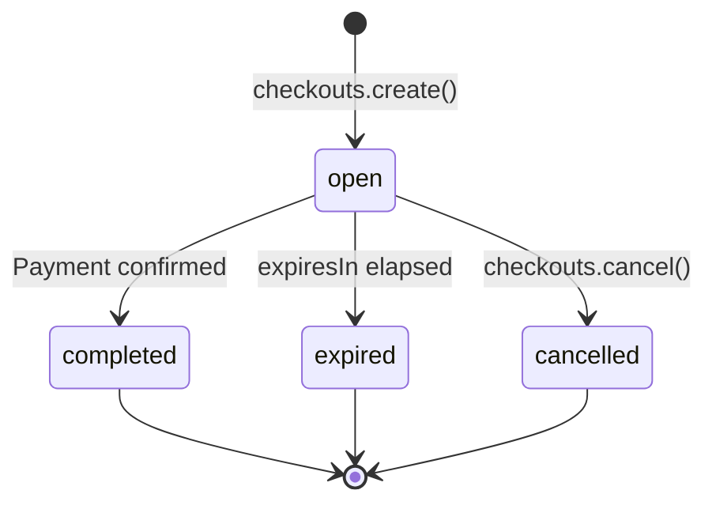

A checkout is one attempt to collect one payment. Create one directly from your backend when you already know the amount, or create one from a [payment link](/payments/payment-links) to reuse a shared template. Either way you get a `checkoutUrl`: send your buyer there to pay.

<Frame caption="What the buyer sees at the checkoutUrl. AgentaOS is the merchant of record, so the page collects the buyer's country, calculates VAT, and shows one total.">
  
</Frame>



## Create a checkout

<Tabs>
  <Tab title="SDK">
    ```typescript
    import { AgentaOS } from '@agentaos/pay';

    const agentaos = new AgentaOS(process.env.AGENTAOS_API_KEY!);

    const checkout = await agentaos.checkouts.create({
      amount: 49.99,
      currency: 'EUR',
      description: 'Order #123',
      successUrl: 'https://myshop.com/success',
      cancelUrl: 'https://myshop.com/cart',
      webhookUrl: 'https://myshop.com/webhooks',
    });

    // Redirect your buyer to pay
    res.redirect(checkout.checkoutUrl);
    ```
  </Tab>
  <Tab title="CLI">
    ```bash
    agenta pay checkout --amount 49.99 --currency EUR --description "Order #123"
    ```
  </Tab>
  <Tab title="cURL">
    ```bash
    curl -X POST https://api.agentaos.ai/api/v1/gateway/sessions \
      -H "x-api-key: sk_live_..." \
      -H "Content-Type: application/json" \
      -d '{
        "amount": 49.99,
        "currency": "EUR",
        "description": "Order #123",
        "successUrl": "https://myshop.com/success",
        "cancelUrl": "https://myshop.com/cart",
        "webhookUrl": "https://myshop.com/webhooks"
      }'
    ```
  </Tab>
</Tabs>

## Money model

A plain `amount` is always in currency units: `49.99` means €49.99, never cents. This holds for every create call, payment link, checkout, and invoice amount in the API. The one exception is `subscription.unitAmountMinor`, which is an integer of the smallest unit (`1999` = €19.99). See [Subscriptions](/payments/subscriptions) for why that field is different. Webhook payloads carry `amount` as a string (`"49.99"`), since JSON numbers lose trailing zeros.

## Create from a payment link

Pass `linkId` to inherit the link's `amount`, `currency`, `description`, `taxRateId`, and URLs. Override anything per-checkout with `amountOverride` or the other fields.

```typescript
const checkout = await agentaos.checkouts.create({
  linkId: link.id,
  metadata: { customerId: '12345' },
});
```

<Tip>
**Payment links vs. standalone checkouts:** use a payment link for anything reusable or shareable, a subscription plan, a donation button, a link you paste in chat. Use a standalone checkout when your backend already knows the amount and buyer at the moment of creation, like an e-commerce order at cart checkout.
</Tip>

<Note>
A standalone (linkless) checkout is always a **one-time** payment, there's no `type` field on checkout create. To sell a subscription, create a subscription payment link (`type: 'subscription'`) and the buyer subscribes at the hosted checkout, or spin up a checkout from that link with `linkId`.
</Note>

## Pre-populate buyer info

If you already know the buyer (from your own account system), pre-fill their details to skip the checkout form:

```typescript
const checkout = await agentaos.checkouts.create({
  amount: 49.99,
  currency: 'EUR',
  buyerEmail: 'john@example.com',
  buyerName: 'John Doe',
  buyerCompany: 'Acme Corp',
  buyerCountry: 'DE',
  buyerVat: 'DE123456789',
  buyerAddress: '123 Main St, Berlin',
});
```

<Info>
If you don't pre-populate, the hosted checkout asks the buyer for name and email directly. Company, VAT, and address are optional but recommended: they land on the invoice.
</Info>

## How the buyer pays

The hosted checkout offers card, Apple Pay, and Google Pay through our card processor. Card details are entered directly into the secure card form, never handled by your server or ours.

<Warning>
Don't trust `successUrl` as proof of payment. The buyer's browser might close before the redirect fires. Use [webhooks](/payments/webhooks) as the source of truth for "did this checkout actually get paid."
</Warning>

## Retrieve a checkout

<Tabs>
  <Tab title="SDK">
    ```typescript
    const checkout = await agentaos.checkouts.retrieve('mZrESFyR7RC9RPsJfZCVkg');
    console.log(checkout.status); // 'open' | 'completed' | 'expired' | 'cancelled'
    ```
  </Tab>
  <Tab title="CLI">
    ```bash
    agenta pay get mZrESFyR7RC9RPsJfZCVkg
    ```
  </Tab>
  <Tab title="cURL">
    ```bash
    curl https://api.agentaos.ai/api/v1/gateway/sessions/mZrESFyR7RC9RPsJfZCVkg \
      -H "x-api-key: sk_live_..."
    ```
  </Tab>
</Tabs>

## List checkouts

Paginated: every list call returns `{ items, total, hasMore }`.

<Tabs>
  <Tab title="SDK">
    ```typescript
    const page = await agentaos.checkouts.list({
      status: 'completed',
      limit: 10,
      offset: 0,
    });
    ```
  </Tab>
  <Tab title="CLI">
    ```bash
    agenta pay list --status completed --limit 10
    ```
  </Tab>
  <Tab title="cURL">
    ```bash
    curl "https://api.agentaos.ai/api/v1/gateway/sessions?status=completed&limit=10" \
      -H "x-api-key: sk_live_..."
    ```
  </Tab>
</Tabs>

## Cancel a checkout

<Tabs>
  <Tab title="SDK">
    ```typescript
    await agentaos.checkouts.cancel('mZrESFyR7RC9RPsJfZCVkg');
    ```
  </Tab>
  <Tab title="cURL">
    ```bash
    curl -X POST https://api.agentaos.ai/api/v1/gateway/sessions/mZrESFyR7RC9RPsJfZCVkg/cancel \
      -H "x-api-key: sk_live_..."
    ```
  </Tab>
</Tabs>

<Note>
Cancelling stops the buyer from paying. If a payment already cleared before the cancel call lands, it still completes; cancelling doesn't reach into the card processor or on-chain state.
</Note>

## Parameters

<ParamField body="amount" type="number">
  Amount in currency units (e.g. `49.99`). Required if no `linkId`.
</ParamField>

<ParamField body="linkId" type="string">
  Create from a payment link template. Inherits its amount, currency, and configuration.
</ParamField>

<ParamField body="currency" type="string" default="org default">
  `EUR` or `USD`.
</ParamField>

<ParamField body="description" type="string">
  Shown on the checkout page. Max 1000 characters.
</ParamField>

<ParamField body="amountOverride" type="number">
  Override the link's amount for this checkout only.
</ParamField>

<ParamField body="successUrl" type="string">
  Redirect the buyer here after payment. HTTPS only.
</ParamField>

<ParamField body="cancelUrl" type="string">
  "Cancel" link on the checkout page. HTTPS only.
</ParamField>

<ParamField body="webhookUrl" type="string">
  Server notification URL for payment events. HTTPS only.
</ParamField>

<ParamField body="taxRateId" type="string">
  UUID of a pre-created tax rate.
</ParamField>

<ParamField body="buyerEmail" type="string">
  Pre-populate buyer email. Max 320 characters.
</ParamField>

<ParamField body="buyerName" type="string">
  Pre-populate buyer name. Max 200 characters.
</ParamField>

<ParamField body="buyerCompany" type="string">
  Pre-populate company name. Max 200 characters.
</ParamField>

<ParamField body="buyerCountry" type="string">
  ISO 3166-1 alpha-2 (e.g. `DE`).
</ParamField>

<ParamField body="buyerAddress" type="string">
  Pre-populate buyer address. Max 500 characters.
</ParamField>

<ParamField body="buyerVat" type="string">
  Pre-populate VAT number (e.g. `DE123456789`).
</ParamField>

<ParamField body="dueDate" type="string">
  ISO date (`YYYY-MM-DD`). Presentation only, stamped onto the invoice once issued.
</ParamField>

<ParamField body="expiresIn" type="number" default="1800">
  Seconds until expiry (300 to 86400).
</ParamField>

<ParamField body="metadata" type="object">
  Custom key-value data, returned unchanged in webhooks. Max 8KB.
</ParamField>

## Response

These are the SDK (camelCase) field names; the raw REST response uses snake_case (e.g. `session_id`, `seller_mode`).

<ResponseField name="id" type="string">Session UUID.</ResponseField>
<ResponseField name="sessionId" type="string">Public session ID, used in the checkout URL.</ResponseField>
<ResponseField name="checkoutUrl" type="string">URL to send your buyer to.</ResponseField>
<ResponseField name="status" type="string">`open`, `completed`, `expired`, or `cancelled`.</ResponseField>
<ResponseField name="sellerMode" type="string">`mor` (card + bank) or `crypto` (on-chain). Inherited from the link, or derived from your account for standalone checkouts.</ResponseField>
<ResponseField name="amountOverride" type="number | null">Amount for this checkout, if overridden.</ResponseField>
<ResponseField name="currency" type="string">Settlement currency.</ResponseField>
<ResponseField name="invoiceId" type="string | null">Issued invoice UUID. `null` until the payment is confirmed.</ResponseField>
<ResponseField name="invoiceNumber" type="string | null">Human-readable invoice number, once issued.</ResponseField>
<ResponseField name="expiresAt" type="string">ISO 8601.</ResponseField>
<ResponseField name="createdAt" type="string">ISO 8601.</ResponseField>

## Next steps

<CardGroup cols={2}>
  <Card title="Payment links" icon="link" href="/payments/payment-links">
    Turn a checkout into a reusable, shareable template.
  </Card>
  <Card title="Subscriptions" icon="rotate" href="/payments/subscriptions">
    Paying a subscription-type link at checkout starts a subscription.
  </Card>
  <Card title="Invoices" icon="file-invoice" href="/payments/invoices">
    Every completed checkout issues a VAT-correct invoice.
  </Card>
  <Card title="Webhooks" icon="bell" href="/payments/webhooks">
    Verify `checkout.session.completed` server-side, don't rely on the redirect.
  </Card>
</CardGroup>
