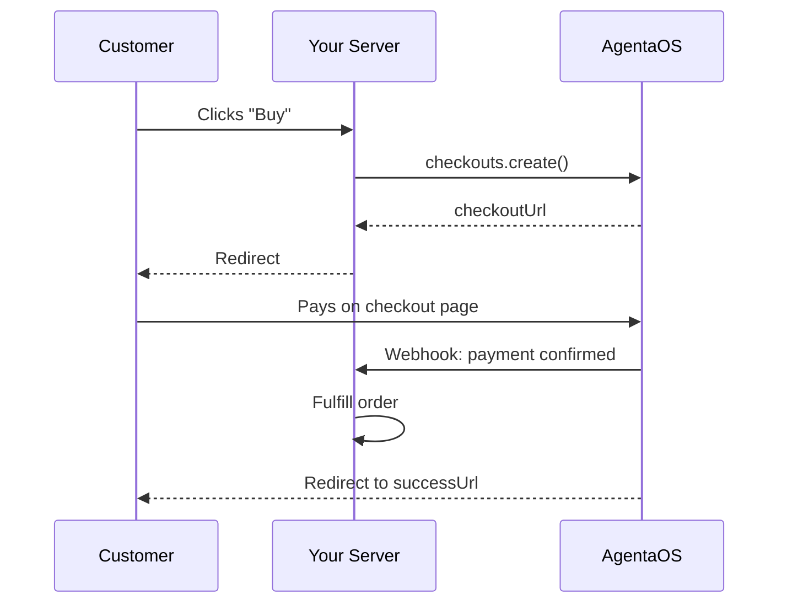

A real e-commerce backend showing how to accept regulated stablecoin payments with AgentaOS.

## Flow



## What It Does

1. Customer clicks "Buy" → your server creates a checkout
2. Customer is redirected to the AgentaOS checkout page
3. Customer pays with their crypto wallet
4. AgentaOS sends a webhook → you fulfill the order
5. Customer is redirected back to your success page

## Prerequisites

```
AGENTAOS_API_KEY=sk_live_...            # Developer → API Keys
AGENTAOS_WEBHOOK_SECRET=whsec_...       # Developer → Webhooks → Reveal signing secret
```

## Full Code

```typescript
import { AgentaOS, WebhookVerificationError } from '@agentaos/pay';
import express from 'express';

const app = express();
const agentaos = new AgentaOS(process.env.AGENTAOS_API_KEY!);

// Simple in-memory order store (use a real database in production)
const orders = new Map();
const sessionToOrder = new Map();

// Parse JSON for all routes except webhooks
app.use((req, res, next) => {
  if (req.path === '/webhooks') return next();
  express.json()(req, res, next);
});

// ─── Create Checkout ───────────────────────────────────────────
app.post('/checkout', async (req, res) => {
  const { product, amount, email } = req.body;

  // 1. Create checkout via SDK
  const checkout = await agentaos.checkouts.create({
    amount: Number(amount),
    currency: 'EUR',
    description: product,
    buyerEmail: email,
    successUrl: 'https://myshop.com/success',
    cancelUrl: 'https://myshop.com/cart',
    webhookUrl: 'https://myshop.com/webhooks',
  });

  // 2. Store order locally
  const orderId = crypto.randomUUID();
  orders.set(orderId, {
    id: orderId,
    product,
    amount,
    sessionId: checkout.sessionId,
    status: 'pending',
  });
  sessionToOrder.set(checkout.sessionId, orderId);

  // 3. Redirect customer to checkout
  res.json({ checkoutUrl: checkout.checkoutUrl });
});

// ─── Webhook Handler ───────────────────────────────────────────
// IMPORTANT: express.raw() preserves body for signature verification
app.post('/webhooks', express.raw({ type: 'application/json' }), (req, res) => {
  let event;
  try {
    event = agentaos.webhooks.verify(
      req.body,
      req.headers['x-agentaos-signature'],
      process.env.AGENTAOS_WEBHOOK_SECRET!,
    );
  } catch (err) {
    if (err instanceof WebhookVerificationError) {
      return res.status(400).send('Invalid signature');
    }
    throw err;
  }

  if (event.type === 'checkout.session.completed') {
    const orderId = sessionToOrder.get(event.data.sessionId);
    const order = orders.get(orderId);
    if (order && order.status === 'pending') {
      order.status = 'paid';
      order.txHash = event.data.txHash;
      console.log(`Order ${orderId} PAID. tx: ${event.data.txHash}`);

      // YOUR BUSINESS LOGIC HERE:
      // - Send confirmation email
      // - Grant access to product
      // - Trigger shipping
    }
  }

  res.sendStatus(200);
});

// ─── Order Status (polling fallback) ───────────────────────────
app.get('/order/:id', async (req, res) => {
  const order = orders.get(req.params.id);
  if (!order) return res.status(404).json({ error: 'Not found' });

  // If still pending, check AgentaOS
  if (order.status === 'pending') {
    const checkout = await agentaos.checkouts.retrieve(order.sessionId);
    if (checkout.status === 'completed') {
      order.status = 'paid';
    }
  }

  res.json({ status: order.status, txHash: order.txHash });
});

app.listen(3001, () => console.log('Shop running at http://localhost:3001'));
```

## Key Points

<AccordionGroup>
  <Accordion title="Don't fulfill on the success page">
    The `successUrl` redirect is best-effort. The customer might close their browser before reaching it. Always fulfill orders via the webhook, that's server-to-server and reliable.
  </Accordion>
  <Accordion title="Use express.raw() for webhooks">
    Webhook signature verification needs the raw request body. If you parse JSON first (`express.json()`), the signature won't match because JSON.stringify doesn't preserve formatting.
  </Accordion>
  <Accordion title="Polling as a fallback">
    If your webhook endpoint is down, you can poll `checkouts.retrieve()` as a backup. Check the session status periodically until it's `completed` or `expired`.
  </Accordion>
  <Accordion title="Idempotent webhook handling">
    Webhooks may be delivered more than once. Use `event.data.sessionId` to check if you've already processed the payment before fulfilling again.
  </Accordion>
</AccordionGroup>

## Source Code

Full source with HTML shop page and error handling:
[github.com/AgentaOS/agentaos/tree/main/examples/pay-express-shop](https://github.com/AgentaOS/agentaos/tree/main/examples/pay-express-shop)
