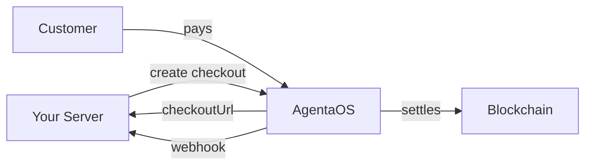

Accept regulated stablecoin payments from your website or application. Your customers pay with stablecoins (USDC, EURe), you get instant settlement to your wallet: no intermediaries, no chargebacks.

<Info>
**What are stablecoins?** Digital currencies pegged 1:1 to real money (USDC = US Dollar, EURe = Euro). Payments settle on the blockchain in seconds: no bank transfers, no chargebacks, no hold periods.
</Info>



## Why AgentaOS Payments?

<CardGroup cols={3}>
  <Card title="Stripe-like DX" icon="code">
    `npm install @agentaos/pay` then create checkouts in 5 lines of code. TypeScript types for everything.
  </Card>
  <Card title="No crypto knowledge" icon="shield-check">
    Your backend creates a checkout, we handle wallets, chains, and settlement. You get a webhook when paid.
  </Card>
  <Card title="Instant settlement" icon="bolt">
    Payments settle on-chain in seconds. No hold periods, no chargebacks, no currency conversion delays.
  </Card>
</CardGroup>

## What You Get

| Feature | Description |
|---------|-------------|
| **Checkouts** | Create payment sessions with amount, currency, buyer info, tax rate |
| **Payment Links** | Reusable shareable URLs for recurring payments |
| **Webhooks** | Real-time `checkout.session.completed` events with HMAC signatures |
| **Invoices** | Auto-generated EU-compliant invoices with exchange rates and VAT |
| **Monthly Statements** | Wise-style PDF with balance reconciliation and VAT summary |
| **CSV Export** | 22-column export for accounting software (Merit, Directo, Xero) |
| **Unified Transactions** | Single ledger for all inbound + outbound payments |
| **Multi-token** | Accept USDC, EURe, EURC, WETH, DAI - settled to your preferred stablecoin |

## Quick Start

<Steps>
  <Step title="Install the SDK">
    ```bash
    npm install @agentaos/pay
    ```
  </Step>
  <Step title="Get your API key">
    Go to [app.agentaos.ai](https://app.agentaos.ai) → Developer → API Keys → Create Key
  </Step>
  <Step title="Create a checkout">
    ```typescript
    import { AgentaOS } from '@agentaos/pay';

    const agentaos = new AgentaOS(process.env.AGENTAOS_API_KEY!);

    const checkout = await agentaos.checkouts.create({
      amount: 49.99,
      currency: 'EUR',
      description: 'Pro Plan - Monthly',
      successUrl: 'https://myshop.com/success',
      webhookUrl: 'https://myshop.com/webhooks',
    });

    console.log(checkout.checkoutUrl);
    // → https://app.agentaos.ai/checkout/mZrESFyR7RC9RPsJfZCVkg
    ```
  </Step>
  <Step title="Handle the webhook">
    ```typescript
    app.post('/webhooks', express.raw({ type: 'application/json' }), (req, res) => {
      const event = agentaos.webhooks.verify(
        req.body,
        req.headers['x-agentaos-signature'],
        process.env.AGENTAOS_WEBHOOK_SECRET!,
      );

      if (event.type === 'checkout.session.completed') {
        fulfillOrder(event.data.sessionId);
      }

      res.sendStatus(200);
    });
    ```
  </Step>
</Steps>

## Integration Path

<Steps>
  <Step title="Get credentials (2 min)">
    Create an API key and reveal your webhook secret in Developer settings.
  </Step>
  <Step title="Create your first checkout (5 min)">
    Follow the [SDK overview](/payments/overview) to create a checkout and get a payment URL.
  </Step>
  <Step title="Handle webhooks (5 min)">
    Set up a [webhook handler](/payments/webhooks) to know when payments are confirmed.
  </Step>
  <Step title="Test end-to-end (10 min)">
    Run the [Express shop example](/payments/example) to see the full flow working.
  </Step>
  <Step title="Add invoicing (optional, 3 min)">
    Configure [tax rates and exports](/payments/invoices) for EU compliance.
  </Step>
</Steps>

## Supported Currencies

| Currency | Token | Network |
|----------|-------|---------|
| EUR | EURe (Monerium) | Base |
| EUR | EURC (Circle) | Base |
| USD | USDC (Circle) | Base |
| USD | USDT (Tether) | Base |
| - | WETH | Base |
| - | DAI | Base |

More networks coming soon. Currently supporting Base mainnet and Base Sepolia (testnet).

## REST API

Don't use TypeScript? The SDK wraps a standard REST API. Use it from any language:

```bash
curl -X POST https://api.agentaos.ai/api/v1/gateway/sessions \
  -H "x-api-key: sk_live_..." \
  -H "Content-Type: application/json" \
  -d '{
    "amount": 49.99,
    "currency": "EUR",
    "description": "Pro Plan",
    "successUrl": "https://myshop.com/success",
    "webhookUrl": "https://myshop.com/webhooks"
  }'
```

See the [API Reference](/payments/api-reference) for all endpoints.
