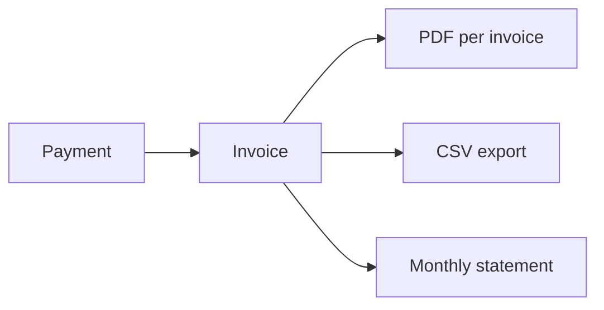

Every confirmed payment generates a tax-compliant invoice with exchange rates, VAT, and buyer info. Export them for your accountant.



## List Invoices

```typescript
const invoices = await agentaos.invoices.list({
  from: '2026-03-01',
  to: '2026-03-31',
  status: 'issued',     // 'all' | 'issued' | 'voided'
  limit: 50,
});
```

## Download Invoice PDF

```typescript
import { writeFileSync } from 'fs';

const pdf = await agentaos.invoices.downloadPdf('invoice-uuid');
writeFileSync('invoice.pdf', pdf);
```

Each PDF includes:
- Merchant and buyer details
- Amount in crypto + fiat equivalent
- Exchange rate with source and timestamp
- Tax breakdown (subtotal, tax amount, total)
- Transaction hash with explorer link

## Download Monthly Statement

Wise-style monthly statement with balance reconciliation, VAT summary, and transaction ledger.

```typescript
const statement = await agentaos.invoices.downloadStatement({
  from: '2026-03-01',
  to: '2026-03-31',
});
writeFileSync('march-statement.pdf', statement);
```

The statement includes:
- **Summary**: Total received, total sent, net flow, transaction count
- **Balance reconciliation**: Opening/closing balance from on-chain data
- **Transaction ledger**: Every inbound and outbound payment with direction, amount, tax
- **VAT summary**: Taxable supplies by rate + exempt supplies

## Export CSV

22-column CSV for accounting software (Merit Aktiva, Directo, Xero, etc.):

```typescript
const csv = await agentaos.invoices.exportCsv({
  from: '2026-03-01',
  to: '2026-03-31',
});
writeFileSync('invoices.csv', csv);
```

**Columns:** date, direction, invoice_number, description, crypto_amount, crypto_token, token_address, chain, exchange_rate, exchange_rate_source, exchange_rate_at, fiat_amount, fiat_currency, tax_name, tax_rate, tax_amount, total_eur, buyer_name, buyer_company, buyer_country, buyer_vat, tx_hash, status

## Void an Invoice

```typescript
await agentaos.invoices.void('invoice-uuid');
```

<Warning>
Voiding an invoice is irreversible. The payment is not refunded, only the accounting record is marked as voided.
</Warning>

## Transactions

List all confirmed payments (inbound received + outbound sent):

```typescript
const txs = await agentaos.transactions.list({
  direction: 'inbound',    // 'all' | 'inbound' | 'outbound'
  from: '2026-03-01',
  to: '2026-03-31',
  limit: 50,
});
```
