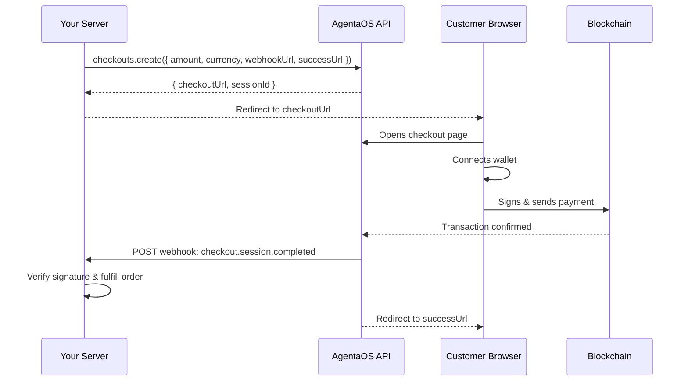

The `@agentaos/pay` package lets you accept regulated stablecoin payments from your Node.js backend. Stripe-like developer experience: create checkouts, handle webhooks, export invoices.

## Install

```bash
npm install @agentaos/pay
```

## Quick Start

```typescript
import { AgentaOS } from '@agentaos/pay';

const agentaos = new AgentaOS(process.env.AGENTAOS_API_KEY!);

const checkout = await agentaos.checkouts.create({
  amount: 49.99,
  currency: 'EUR',
  description: 'Pro Plan - Monthly',
  successUrl: 'https://myshop.com/success',
  cancelUrl: 'https://myshop.com/cart',
  webhookUrl: 'https://myshop.com/webhooks',
});

// Send your customer here to pay
console.log(checkout.checkoutUrl);
```

<Warning>
**Backend only.** Never use this SDK in browser code. Your API key grants full access to all payments.
</Warning>

## How It Works



<Steps>
  <Step title="Create checkout">
    Your server calls `checkouts.create()` with amount, currency, and URLs.
  </Step>
  <Step title="Redirect customer">
    Send the customer to `checkoutUrl` - they see the AgentaOS checkout page.
  </Step>
  <Step title="Customer pays">
    Customer connects their wallet and confirms the payment on-chain.
  </Step>
  <Step title="Webhook notification">
    AgentaOS sends `checkout.session.completed` to your `webhookUrl` with the transaction hash.
  </Step>
  <Step title="Fulfill order">
    Verify the webhook signature, then deliver the product.
  </Step>
</Steps>

## What You Can Do

| Feature | Method |
|---------|--------|
| Accept a payment | `agentaos.checkouts.create()` |
| Check payment status | `agentaos.checkouts.retrieve()` |
| Create reusable payment links | `agentaos.paymentLinks.create()` |
| Verify webhook signatures | `agentaos.webhooks.verify()` |
| List all transactions | `agentaos.transactions.list()` |
| Download invoices | `agentaos.invoices.downloadPdf()` |
| Export monthly CSV | `agentaos.invoices.exportCsv()` |
| Download statement PDF | `agentaos.invoices.downloadStatement()` |

## Authentication

Get your API key from [app.agentaos.ai](https://app.agentaos.ai) → Developer → API Keys.

```typescript
const agentaos = new AgentaOS('sk_live_...', {
  baseUrl: 'https://api.agentaos.ai', // default
  timeout: 30000,                      // ms
  maxRetries: 2,                       // retries on 5xx
  debug: false,                        // log requests to stderr
});
```

## Requirements

- Node.js 20+
- Zero dependencies (uses native `fetch` and `crypto`)
