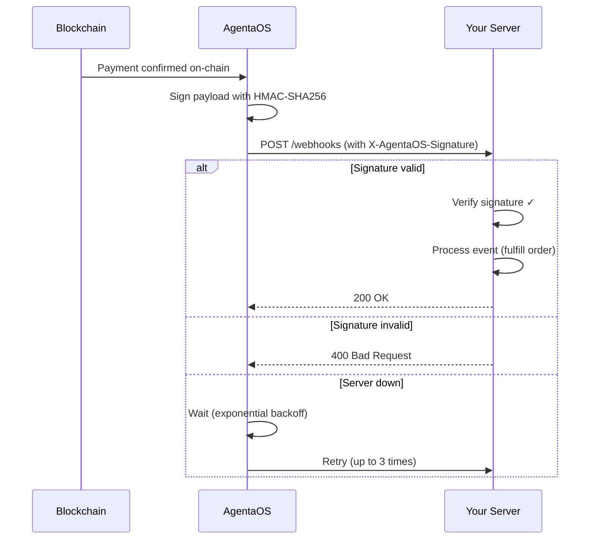

AgentaOS sends webhook events to your server when payments are confirmed. Always verify the signature before processing.

## Setup

1. Go to [app.agentaos.ai](https://app.agentaos.ai) → Developer → Webhooks
2. Set your webhook URL (e.g. `https://myshop.com/webhooks`)
3. Click "Reveal signing secret" → copy the `whsec_...` value
4. Add it to your server as `AGENTAOS_WEBHOOK_SECRET`

<Warning>
The signing secret is stable - it doesn't change when you update the URL. You can rotate it with the "Rotate" button if compromised.
</Warning>

## Verify Signatures

```typescript
import { AgentaOS, WebhookVerificationError } from '@agentaos/pay';
import express from 'express';

const agentaos = new AgentaOS(process.env.AGENTAOS_API_KEY!);

// IMPORTANT: Use express.raw(). signature verifies the raw body
app.post('/webhooks', express.raw({ type: 'application/json' }), (req, res) => {
  try {
    const event = agentaos.webhooks.verify(
      req.body,
      req.headers['x-agentaos-signature'] as string,
      process.env.AGENTAOS_WEBHOOK_SECRET!,
    );

    switch (event.type) {
      case 'checkout.session.completed':
        console.log('Payment received:', event.data.amount);
        fulfillOrder(event.data.sessionId);
        break;
      case 'send.completed':
        console.log('Send confirmed:', event.data.txHash);
        break;
      case 'send.failed':
        console.log('Send failed:', event.data.transactionId);
        break;
    }

    res.sendStatus(200);
  } catch (err) {
    if (err instanceof WebhookVerificationError) {
      return res.status(400).send('Invalid signature');
    }
    res.status(500).send('Webhook processing failed');
  }
});
```

<Tip>
Always return `200` after processing. AgentaOS retries on non-2xx responses (up to 3 times with exponential backoff).
</Tip>

## Delivery Flow



## Signature Format

Every webhook includes an `X-AgentaOS-Signature` header:

```
X-AgentaOS-Signature: t=1710791400,v1=5257a869e7ecebeda32affa62cdca3fa51cad7e77a0e56ff536d0ce8e108d8bd
```

| Part | Description |
|------|-------------|
| `t` | Unix timestamp (seconds) when the signature was created |
| `v1` | HMAC-SHA256 hex digest of `{timestamp}.{body}` |

### Manual Verification (without SDK)

```python
import hmac, hashlib, time

def verify_webhook(body: str, signature: str, secret: str) -> bool:
    parts = dict(p.split('=', 1) for p in signature.split(','))
    timestamp = int(parts['t'])

    # Reject old signatures (5 minute tolerance)
    if abs(time.time() - timestamp) > 300:
        return False

    expected = hmac.new(
        secret.encode(),
        f"{timestamp}.{body}".encode(),
        hashlib.sha256
    ).hexdigest()

    return hmac.compare_digest(expected, parts['v1'])
```

## Events

### `checkout.session.completed`

Fired when a payment is confirmed on-chain.

```json
{
  "id": "evt_a1b2c3d4",
  "type": "checkout.session.completed",
  "data": {
    "linkId": "secureLinkId",
    "sessionId": "mZrESFyR7RC9RPsJfZCVkg",
    "amount": "49.99",
    "currency": "EURe",
    "txHash": "0xabc...",
    "payer": "0x1234...",
    "payerType": "human",
    "network": "eip155:8453",
    "metadata": { "orderId": "order-123" }
  }
}
```

### `send.completed`

Fired when an outbound send is confirmed on-chain.

```json
{
  "id": "evt_d5e6f7g8",
  "type": "send.completed",
  "data": {
    "transactionId": "uuid",
    "txHash": "0xdef...",
    "from": "0xorgwallet...",
    "to": "0xrecipient...",
    "amount": "100.00",
    "token": "USDC",
    "chainId": 8453,
    "network": "eip155:8453"
  }
}
```

### `send.failed`

Fired when an outbound send broadcast fails.

```json
{
  "id": "evt_h9i0j1k2",
  "type": "send.failed",
  "data": {
    "transactionId": "uuid",
    "txHash": null,
    "from": "0xorgwallet...",
    "to": "0xrecipient...",
    "amount": "100.00",
    "token": "USDC",
    "chainId": 8453,
    "network": "eip155:8453"
  }
}
```

## Best Practices

<CardGroup cols={2}>
  <Card title="Don't trust the redirect" icon="arrow-right">
    The `successUrl` redirect is best-effort. The customer might close their browser. Always use webhooks as the source of truth.
  </Card>
  <Card title="Idempotent handling" icon="repeat">
    Webhook events may be delivered more than once. Use `event.data.sessionId` or `event.data.txHash` to deduplicate.
  </Card>
  <Card title="Respond quickly" icon="bolt">
    Return `200` immediately. Do heavy processing (emails, shipping) asynchronously.
  </Card>
  <Card title="Verify first" icon="shield-check">
    Always verify the signature before processing. Never trust the raw body without verification.
  </Card>
</CardGroup>
