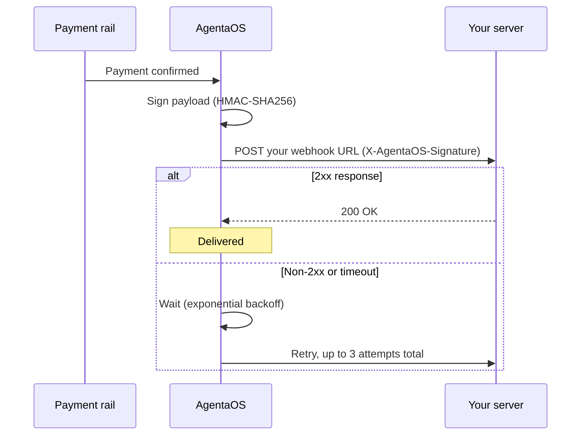

AgentaOS sends a webhook to your server when something happens in your account: a checkout is paid, a subscription renews or changes, a dispute opens, and more. [Events](/webhooks/events) lists every event and its payload. Webhooks tell your backend about a payment without polling. Build on them, not on the browser redirect after checkout.

<Warning>
**Always verify the signature before you act on a webhook body.** Anyone who knows your webhook URL can POST a fake payload to it. Verification is what proves the request actually came from AgentaOS.
</Warning>

## Register a webhook URL

<Steps>
  <Step title="Open the webhook settings">
    In [app.agentaos.ai](https://app.agentaos.ai), open **Settings → Developers → Webhooks**.
  </Step>
  <Step title="Set your endpoint">
    Enter the HTTPS URL you want events sent to, for example `https://myshop.com/webhooks`, and click **Save**. AgentaOS does not deliver to `localhost` or a private address: for local development, use a public HTTPS tunnel.
  </Step>
  <Step title="Reveal the signing secret">
    Click **Reveal signing secret** and copy the `whsec_...` value.
  </Step>
  <Step title="Store it as a secret">
    Add it to your server's environment as `AGENTAOS_WEBHOOK_SECRET`. Never commit it, never log it, never send it to the client.
  </Step>
</Steps>

<Warning>
The signing secret stays the same when you change the URL. If you suspect it has been exposed, click **Rotate secret** to issue a new one. Rotating invalidates the old secret immediately, so deploy the new value first if you cannot afford failed deliveries.
</Warning>

<Tip>
You can also pass a `webhookUrl` when you create a [checkout](/payments/checkouts) or [payment link](/payments/payment-links). That payment's `checkout.session.completed` then goes to that URL instead of your account's URL, signed with the same account secret. Every other event goes to the account's URL.
</Tip>

## Verify the signature

Every webhook request carries an `X-AgentaOS-Signature` header. Verifying it proves two things: the payload came from AgentaOS, and it hasn't been replayed from an old request.

<CodeGroup>
```typescript SDK (@agentaos/pay)
import { AgentaOS, WebhookVerificationError } from '@agentaos/pay';
import express from 'express';

const agentaos = new AgentaOS(process.env.AGENTAOS_API_KEY!);
const app = express();

// IMPORTANT: use express.raw() here. Verification signs the RAW body.
// If a JSON body parser runs first, the reserialized body won't match
// the signature and every event will fail verification.
app.post('/webhooks', express.raw({ type: 'application/json' }), (req, res) => {
  let event;
  try {
    event = agentaos.webhooks.verify(
      req.body,
      req.headers['x-agentaos-signature'] as string,
      process.env.AGENTAOS_WEBHOOK_SECRET!,
    );
  } catch (err) {
    if (err instanceof WebhookVerificationError) {
      res.status(400).send('Invalid signature');
      return;
    }
    res.status(500).send('Webhook processing failed');
    return;
  }

  // Signature is valid: safe to act on event.data now.
  switch (event.type) {
    case 'checkout.session.completed':
      fulfillOrder(event.data.sessionId, event.data.amount); // your own code
      break;
    case 'send.completed':
      console.log('Send confirmed:', event.data.txHash);
      break;
    case 'send.failed':
      console.log('Send failed:', event.data.transactionId);
      break;
  }

  res.sendStatus(200);
});

app.listen(3000);
```
</CodeGroup>

`webhooks.verify()` does four things, in order. It parses the `t=...,v1=...` header, and rejects a timestamp older than 5 minutes or in the future (replay protection). It recomputes the HMAC-SHA256 digest and compares it in constant time. Then it parses and returns a typed `WebhookEvent`. Any failure throws `WebhookVerificationError` instead of returning a falsy value, so your code cannot skip the check by accident.

### Manual verification (no SDK)

The algorithm is HMAC-SHA256 over `{timestamp}.{raw_body}`, so any language with an HMAC and a constant-time compare can check it. The samples below apply the SDK's time rule: they reject a timestamp older than the tolerance, and a timestamp in the future by any amount. Keep your server's clock synced (NTP), or a clock that runs behind rejects every event.

<CodeGroup>
```python Python
import hmac, hashlib, time

def verify_webhook(body: str, signature: str, secret: str, tolerance_sec: int = 300) -> bool:
    parts = dict(p.split("=", 1) for p in signature.split(","))
    timestamp = int(parts["t"])

    # Reject old and future signatures (replay protection)
    age = int(time.time()) - timestamp
    if age < 0 or age > tolerance_sec:
        return False

    expected = hmac.new(
        secret.encode(),
        f"{timestamp}.{body}".encode(),
        hashlib.sha256,
    ).hexdigest()

    return hmac.compare_digest(expected, parts["v1"])
```

```go Go
package main

import (
	"crypto/hmac"
	"crypto/sha256"
	"encoding/hex"
	"fmt"
	"strconv"
	"strings"
	"time"
)

func verifyWebhook(body []byte, signature, secret string, toleranceSec int64) bool {
	parts := map[string]string{}
	for _, p := range strings.Split(signature, ",") {
		if kv := strings.SplitN(p, "=", 2); len(kv) == 2 {
			parts[kv[0]] = kv[1]
		}
	}
	timestamp, err := strconv.ParseInt(parts["t"], 10, 64)
	if err != nil || parts["v1"] == "" {
		return false
	}
	if age := time.Now().Unix() - timestamp; age > toleranceSec || age < 0 {
		return false // expired or in the future
	}

	mac := hmac.New(sha256.New, []byte(secret))
	mac.Write([]byte(fmt.Sprintf("%d.%s", timestamp, body)))
	expected := hex.EncodeToString(mac.Sum(nil))

	return hmac.Equal([]byte(expected), []byte(parts["v1"]))
}
```

```php PHP
<?php
function verify_webhook(string $body, string $signature, string $secret, int $toleranceSec = 300): bool {
    $parts = [];
    foreach (explode(',', $signature) as $pair) {
        [$key, $value] = array_pad(explode('=', $pair, 2), 2, null);
        $parts[$key] = $value;
    }
    $timestamp = (int) ($parts['t'] ?? 0);
    if (!$timestamp || empty($parts['v1'])) {
        return false;
    }
    $age = time() - $timestamp;
    if ($age < 0 || $age > $toleranceSec) {
        return false; // expired or in the future
    }

    $expected = hash_hmac('sha256', "{$timestamp}.{$body}", $secret);
    return hash_equals($expected, $parts['v1']);
}
```
</CodeGroup>

<Warning>
Use a **constant-time comparison** (`hmac.compare_digest`, `hmac.Equal`, `hash_equals`, `crypto.timingSafeEqual`), never `==` or `===`. A naive string comparison leaks timing information an attacker can use to forge a valid signature byte by byte.
</Warning>

### Signature format

```
X-AgentaOS-Signature: t=1710791400,v1=5257a869e7ecebeda32affa62cdca3fa51cad7e77a0e56ff536d0ce8e108d8bd
```

| Part | Description |
|------|-------------|
| `t` | Unix timestamp (seconds) when AgentaOS signed the payload |
| `v1` | HMAC-SHA256 hex digest of `{t}.{raw_body}`, keyed with your webhook signing secret |

The timestamp `t` is part of the signed content, so a captured request cannot be replayed later: verification rejects anything older than 5 minutes by default, or dated in the future.

## Delivery and retries


```mermaid
sequenceDiagram
    participant P as Payment rail
    participant A as AgentaOS
    participant S as Your server

    P->>A: Payment confirmed
    A->>A: Sign payload (HMAC-SHA256)
    A->>S: POST your webhook URL (X-AgentaOS-Signature)
    alt 2xx response
        S-->>A: 200 OK
        Note over A: Delivered
    else Non-2xx or timeout
        A->>A: Wait (exponential backoff)
        A->>S: Retry, up to 3 attempts total
    end
```

When your endpoint does not answer `2xx` in time, AgentaOS tries again, up to 3 attempts in all, and then marks the event `failed`. You can send a failed event again from **Settings → Developers → Webhooks**. The exact timeouts, waits and refused addresses are in [Delivery and retries](/webhooks/events#delivery-and-retries).

<Tip>
Return `200` as soon as you have verified the signature and stored the event (a job, a database row). Do the actual work, such as fulfillment emails and external API calls, after you respond. A slow handler is the most common reason a delivery fails and repeats.
</Tip>

## Best practices

<Columns cols={2}>
  <Card title="Don't trust the redirect" icon="arrow-right">
    The customer can close the browser before the `successUrl` redirect fires. Treat the webhook, not the redirect, as the proof that a payment happened.
  </Card>
  <Card title="Handle idempotently" icon="repeat">
    Retries mean the same event can arrive more than once. Record a key per event and make your handler safe to run twice. The key for each event type is in [Deduplication](/webhooks/events#deduplication).
  </Card>
  <Card title="Respond quickly" icon="bolt">
    Verify, queue, return `200`. Do the slow work outside the request.
  </Card>
  <Card title="Verify every time" icon="shield-check">
    Never branch on `event.data` before `webhooks.verify()` (or the manual equivalent) has returned successfully.
  </Card>
</Columns>

## Next steps

<Columns cols={2}>
  <Card title="Event reference" icon="bell" href="/webhooks/events">
    Every event type, its full payload, and a JSON example.
  </Card>
  <Card title="Payment SDK: Webhooks" icon="node-js" href="/sdk/pay-webhooks">
    The `webhooks` resource in `@agentaos/pay`, in full.
  </Card>
  <Card title="Checkouts" icon="link" href="/payments/checkouts">
    Set a per-checkout `webhookUrl` when you create one.
  </Card>
  <Card title="Payouts" icon="money-bill-transfer" href="/payouts/overview">
    What happens to your balance after a payment lands.
  </Card>
</Columns>
