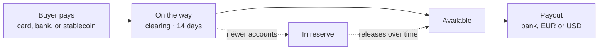

Every payment you accept, card, bank transfer, or stablecoin, settles to one AgentaOS balance. You don't reconcile three settlement accounts for three payment methods. Your balance settles in **EUR or USD**, and from that one balance payouts run automatically to your bank account.

<Frame caption="Your balance, in EUR and USD, on the Payments page.">
  
</Frame>

## Your balance

Money doesn't move from "buyer paid" to "in your bank account" instantly. It passes through a few states first, mirroring how card networks and banking rails actually clear funds.

<CardGroup cols={2}>
  <Card title="On the way" icon="clock">
    A payment has been confirmed, but it's still clearing. New card and bank sales clear over about 14 days before they're payable, the same way they would through any card acquirer.
  </Card>
  <Card title="Available" icon="wallet">
    Cleared and yours to pay out. This is what moves on your next payout.
  </Card>
  <Card title="In reserve" icon="vault">
    A small reserve is held on newer accounts to cover refunds and chargebacks. It releases over time as your payment history builds.
  </Card>
  <Card title="Next payout" icon="calendar">
    The date your available balance is scheduled to move. Shown per currency on the **Payouts** page.
  </Card>
</CardGroup>

## Where payouts go

Your balance pays out by bank transfer, same-currency: EUR to a EUR account and USD to a USD account, with no cross-currency FX.

<Card title="Bank account" icon="building-columns">
  Paid through our banking partner to the countries listed in [Supported countries](/mor/supported-countries), in the currency your balance holds. Cross-border routes carry a Swift fee (see the fee table on that page).
</Card>

## Schedule

Payouts **run automatically twice a month**. Your available balance moves to your bank account on the scheduled payout date, shown per currency on the **Payouts** page. There's nothing to trigger by hand.

## Fees

Payout fees are a **pass-through, at cost, with no markup**. AgentaOS doesn't add anything on top of what the banking or on-chain rail actually costs to move your money. For bank payouts, cross-border routes carry a Swift fee, see the fee table on [Supported countries](/mor/supported-countries) for the current routes and amounts.

## Getting paid out

<Steps>
  <Step title="Accept a payment">
    Any completed checkout, card, bank, or stablecoin, adds to your balance. See [Checkouts](/payments/checkouts) and [Payment links](/payments/payment-links).
  </Step>
  <Step title="Let it clear">
    Funds move from **On the way** to **Available** automatically, over about 14 days for new card and bank sales. No action needed on your end.
  </Step>
  <Step title="Add a bank account">
    Add the bank account where you want to receive your payouts, in EUR or USD.
  </Step>
  <Step title="Get paid">
    Your available balance moves to your bank account automatically, twice a month, on the schedule shown on the **Payouts** page.
  </Step>
</Steps>

## FAQ

<AccordionGroup>
  <Accordion title="What currencies can I pay out in?">
    Your balance settles in EUR or USD. Bank payouts are same-currency, EUR to a EUR account and USD to a USD account, with no cross-currency FX.
  </Accordion>
  <Accordion title="How often do payouts run?">
    Automatically, twice a month. Your available balance moves on the scheduled payout date shown on the **Payouts** page.
  </Accordion>
  <Accordion title="Do I need to set up anything before I can pay out?">
    Yes. Add the bank account you want to receive payouts to first.
  </Accordion>
  <Accordion title="Does a refund or chargeback affect my balance?">
    Yes, refunded or disputed amounts are deducted from your balance rather than paid out. On newer accounts a small reserve is held to cover them.
  </Accordion>
</AccordionGroup>

## Legacy

<CardGroup cols={1}>
  <Card title="Stablecoin payouts (legacy)" icon="wallet" href="/legacy/stablecoin-payouts">
    An optional, advanced way to withdraw your balance on-chain to a wallet you control, from anywhere. You're moving your own balance to your own address.
  </Card>
</CardGroup>

## Next steps

<CardGroup cols={2}>
  <Card title="Supported countries" icon="globe" href="/mor/supported-countries">
    Where bank payouts reach, and the payout fee table.
  </Card>
  <Card title="How Merchant of Record works" icon="scale-balanced" href="/mor/how-it-works">
    How a payment turns into money on your balance in the first place.
  </Card>
  <Card title="Checkouts" icon="link" href="/payments/checkouts">
    Create the payments that fund your balance.
  </Card>
  <Card title="Webhooks" icon="bell" href="/payments/webhooks">
    Get notified the moment a checkout completes.
  </Card>
</CardGroup>
