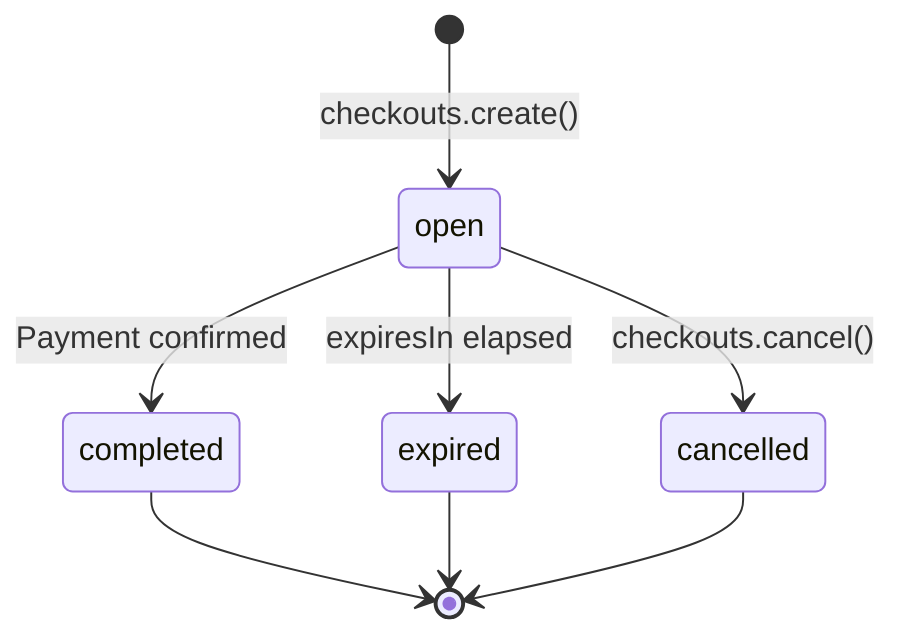

A checkout is a single payment attempt: one amount, one buyer, one `checkoutUrl`. Create one from your backend when you know the amount at request time (an e-commerce order, an invoice you're collecting on). For a reusable, shareable URL, use a [payment link](/sdk/pay-payment-links) instead, its `checkouts.create({ linkId })` call is how each visitor gets their own session.

<Note>
A standalone (linkless) checkout is always a **one-time** payment, there's no `type` field on `checkouts.create()`. To sell a subscription, create a subscription payment link (`type: 'subscription'`) and the buyer subscribes at the hosted checkout, or open a session from that link with `checkouts.create({ linkId })`.
</Note>



## `checkouts.create(params)`

```typescript
const checkout = await agentaos.checkouts.create({
  amount: 100.00,
  currency: 'EUR',
  description: 'Order #123',
  successUrl: 'https://shop.com/success',
  cancelUrl: 'https://shop.com/cart',
  webhookUrl: 'https://shop.com/webhooks',
});

res.redirect(checkout.checkoutUrl);
```


### Parameters

<ParamField body="amount" type="number">
  Amount in currency units, e.g. `49.99`. **Required if `linkId` is omitted.** Min `0.01`, max `1,000,000`.
</ParamField>

<ParamField body="currency" type="string">
  `'EUR'` or `'USD'`. Defaults to your org's settlement currency.
</ParamField>

<ParamField body="linkId" type="string">
  UUID of an existing payment link to create this session from. The session inherits the link's `amount`, `currency`, `description`, `taxRateId`, `successUrl`, `cancelUrl`, and `webhookUrl`, all overridable per-field. Omit for a standalone checkout.
</ParamField>

<ParamField body="amountOverride" type="number">
  When creating from a `linkId`, override the link's amount for this session only. Min `0.01`, max `1,000,000`.
</ParamField>

<ParamField body="description" type="string">
  Shown on the checkout page. Max 1000 characters.
</ParamField>

<ParamField body="taxRateId" type="string">
  UUID of a pre-created tax rate.
</ParamField>

<ParamField body="successUrl" type="string">
  Redirect target after payment. **HTTPS only**, max 2048 characters.
</ParamField>

<ParamField body="cancelUrl" type="string">
  Target for the checkout page's "cancel" link. **HTTPS only**, max 2048 characters.
</ParamField>

<ParamField body="webhookUrl" type="string">
  Where AgentaOS POSTs the `checkout.session.completed` event. **HTTPS only**, max 2048 characters. See [Webhooks](/sdk/pay-webhooks).
</ParamField>

<ParamField body="expiresIn" type="number" default="1800">
  Seconds until the session expires. Range `300`–`86400`.
</ParamField>

<ParamField body="dueDate" type="string">
  `YYYY-MM-DD`. Presentation only, stamped onto the invoice issued for this session once payment completes. Never affects the money path.
</ParamField>

<ParamField body="supportedNetworks" type="string[]">
  CAIP-2 network IDs, e.g. `['eip155:8453']`. Defaults to Base mainnet. Only relevant for on-chain (crypto) settlement.
</ParamField>

<ParamField body="metadata" type="object">
  Arbitrary key-value data, round-tripped onto the session and onto the webhook payload. Max 8KB serialized.
</ParamField>

### Pre-populate buyer info

Skip the checkout form's fields by pre-filling what you already know:

```typescript
const checkout = await agentaos.checkouts.create({
  amount: 100.00,
  currency: 'EUR',
  buyerEmail: 'john@example.com',
  buyerName: 'John Doe',
  buyerCompany: 'Acme Corp',
  buyerCountry: 'DE',
  buyerVat: 'DE123456789',
  buyerAddress: '123 Main St, Berlin',
});
```

<ParamField body="buyerEmail" type="string">
  Max 320 characters.
</ParamField>
<ParamField body="buyerName" type="string">
  Max 200 characters.
</ParamField>
<ParamField body="buyerCompany" type="string">
  Max 200 characters.
</ParamField>
<ParamField body="buyerCountry" type="string">
  ISO 3166-1 alpha-2, e.g. `'DE'`. Max 2 characters.
</ParamField>
<ParamField body="buyerAddress" type="string">
  Max 500 characters.
</ParamField>
<ParamField body="buyerVat" type="string">
  Max 20 characters, e.g. `'DE123456789'`.
</ParamField>

<Tip>
Company, VAT, and address are optional but recommended, they land directly on the invoice AgentaOS issues for EU VAT compliance. If you skip buyer fields entirely, the checkout page collects name and email itself before payment.
</Tip>

### Response

<ResponseField name="id" type="string">Session UUID.</ResponseField>
<ResponseField name="sessionId" type="string">Public session ID, embedded in `checkoutUrl`.</ResponseField>
<ResponseField name="paymentLinkId" type="string | null">Set when created from a `linkId`; `null` for a standalone checkout.</ResponseField>
<ResponseField name="orgId" type="string">Your organization's UUID.</ResponseField>
<ResponseField name="checkoutUrl" type="string">URL to send your human customer to.</ResponseField>
<ResponseField name="x402Url" type="string">x402 protocol URL for AI-agent payers.</ResponseField>
<ResponseField name="status" type="'open' | 'completed' | 'expired' | 'cancelled'">Current session status.</ResponseField>
<ResponseField name="sellerMode" type="'mor' | 'crypto'">How this session settles. Resolved server-side, see the note above.</ResponseField>
<ResponseField name="amountOverride" type="number | null">The amount for this session (currency units), or `null` if unset.</ResponseField>
<ResponseField name="currency" type="string">Settlement currency.</ResponseField>
<ResponseField name="metadata" type="object">Whatever you passed in `metadata`.</ResponseField>
<ResponseField name="successUrl" type="string | null" />
<ResponseField name="cancelUrl" type="string | null" />
<ResponseField name="invoiceId" type="string | null">Set once an invoice is issued for this session; `null` until then.</ResponseField>
<ResponseField name="invoiceNumber" type="string | null">Human-readable invoice number, e.g. `'INV-2026-0001'`.</ResponseField>
<ResponseField name="expiresAt" type="string">ISO 8601.</ResponseField>
<ResponseField name="createdAt" type="string">ISO 8601.</ResponseField>
<ResponseField name="updatedAt" type="string">ISO 8601.</ResponseField>

```json
{
  "id": "a1b2c3d4-...",
  "paymentLinkId": null,
  "orgId": "b7e2a1c4-...",
  "sessionId": "mZrESFyR7RC9RPsJfZCVkg",
  "checkoutUrl": "https://app.agentaos.ai/checkout/mZrESFyR7RC9RPsJfZCVkg",
  "x402Url": "https://api.agentaos.ai/gateway/v1/x402/mZrESFyR7RC9RPsJfZCVkg",
  "status": "open",
  "sellerMode": "mor",
  "amountOverride": 100.00,
  "currency": "EUR",
  "metadata": {},
  "successUrl": "https://shop.com/success",
  "cancelUrl": "https://shop.com/cart",
  "invoiceId": null,
  "invoiceNumber": null,
  "expiresAt": "2026-08-06T02:30:00.000Z",
  "createdAt": "2026-08-06T02:00:00.000Z",
  "updatedAt": "2026-08-06T02:00:00.000Z"
}
```

## `checkouts.retrieve(sessionId)`

```typescript
const checkout = await agentaos.checkouts.retrieve('mZrESFyR7RC9RPsJfZCVkg');
console.log(checkout.status); // 'open' | 'completed' | 'expired' | 'cancelled'
```

Returns the same shape as `create()`. Poll this as a fallback if your webhook endpoint is ever unreachable, see [Webhooks](/sdk/pay-webhooks).

## `checkouts.list(params?)`

```typescript
const page = await agentaos.checkouts.list({
  status: 'completed',
  limit: 10,
  offset: 0,
});
console.log(page.items, page.total, page.hasMore);
```

<ParamField query="status" type="'open' | 'completed' | 'expired' | 'cancelled'">
  Filter by status. Omit to list all statuses.
</ParamField>
<ParamField query="limit" type="number" default="20">Max 100.</ParamField>
<ParamField query="offset" type="number" default="0" />

Returns `PaginatedList<Checkout>` (`{ items, total, hasMore }`), see [Pagination](/sdk/pay-overview#pagination).

## `checkouts.cancel(sessionId)`

```typescript
await agentaos.checkouts.cancel('mZrESFyR7RC9RPsJfZCVkg');
// → { success: true }
```

<Note>
Cancelling prevents the customer from paying through that session. If a payment was already in flight (card authorized, on-chain broadcast) when you cancel, it may still complete, cancel is a status change, not a mid-transaction abort.
</Note>

## Next steps

<CardGroup cols={2}>
  <Card title="Payment links" icon="link" href="/sdk/pay-payment-links">
    Reusable templates. Each visit calls `checkouts.create({ linkId })` under the hood.
  </Card>
  <Card title="Webhooks" icon="tower-broadcast" href="/sdk/pay-webhooks">
    Get notified server-side the moment a checkout completes.
  </Card>
  <Card title="Invoices" icon="receipt" href="/sdk/pay-invoices">
    Every completed checkout issues an invoice you can pull by `invoiceId`.
  </Card>
  <Card title="Errors" icon="triangle-exclamation" href="/sdk/pay-errors">
    What `create()` throws on bad params, and how retries work.
  </Card>
</CardGroup>
